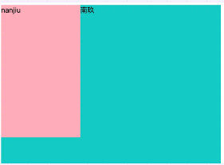
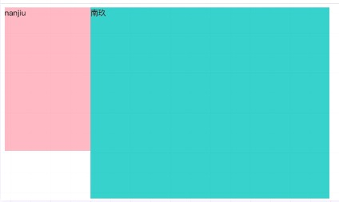
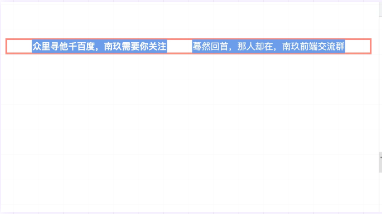
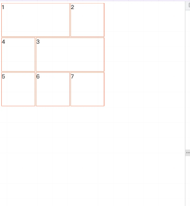

# 前端的那些"KFC"布局

## Box 布局基本单位

* block-level Box： 当元素的 CSS 属性 display 为 block, list-item 或 table 时，它是块级元素 block-level 。块级元素视觉上呈现为块，竖直排列。每个块级元素至少生成一个块级盒（block-level Box）参与 BFC ，称为主要块级盒(principal block-level box)。
* Inline-level Box： 当元素的 CSS 属性 display 的计算值为 inline, inline-block 或 inline-table 时，称它为行内级元素。视觉上它将内容与其它行内级元素排列为多行。典型的如段落内容，有文本或图片，都是行内级元素。行内级元素生成行内级盒(inline-level boxes)，参与行内格式化上下文 IFC 。
* flex container： 当元素的 CSS 属性 display 的计算值为 flex 或 inline-flex ，称它为弹性容器。display:flex这个值会导致一个元素生成一个块级（block-level）弹性容器框。display:inline-flex这个值会导致一个元素生成一个行内级（inline-level）弹性容器框。
* grid container：当元素的 CSS 属性 display 的计算值为 grid 或 inline-grid，称它为栅格容器。

## BFC（Block Formatting Contexts）块级格式化上下文

W3C官方解释为：BFC它决定了元素如何对其内容进行定位，以及与其它元素的关系和相互作用，当涉及到可视化布局时，Block Formatting Context提供了一个环境，HTML在这个环境中按照一定的规则进行布局。

### 1.如何触发BFC？
* 根元素或其它包含它的元素
* 浮动 float: left/right/inherit
* 绝对定位元素 position: absolute/fixed
* 行内块 display: inline-block
* 表格单元格 display: table-cell
* 表格标题 display: table-caption
* 溢出元素 overflow: hidden/scroll/auto/inherit
* 弹性盒子 display: flex/inline-flex

### 2.BFC布局规则
* 内部的Box会在垂直方向，一个接一个地放置。
* Box垂直方向的距离由margin决定。属于同一个BFC的两个相邻Box的margin会发生重叠。
* 每个元素的margin box的左边， 与包含块border box的左边相接触(对于从左往右的格式化，否则相反)。即使存在浮动也是如此。
* BFC的区域不会与float box重叠。
* BFC就是页面上的一个隔离的独立容器，容器里面的子元素不会影响到外面的元素。反之也如此。
* 计算BFC的高度时，浮动元素也参与计算

### 3.BFC应用场景
* 块级元素垂直方向margin重叠
* 高度塌陷问题 float脱离了普通文档流，导致外层容器没办法撑起高度，使得背景颜色没有显示出来。
* 清除浮动
```html
<style>
.aside {
  float: left;
  width:180px;
  height: 300px;
  background:lightpink;
  }
  .container{
    width:500px;
    height:400px;
    background:mediumturquoise;
  }
</style>
<body>
    <div class="outer_box">
        <div class="aside">nanjiu</div>
        <div class="container">南玖</div>
    </div>
</body>
```


```html
<style>
.aside {
  float: left;
  width:180px;
  height: 300px;
  background:lightpink;
  }
  .container{
    width:500px;
    height:400px;
    background:mediumturquoise;
    overflow: hidden;
  }
</style>
<body>
    <div class="outer_box">
        <div class="aside">nanjiu</div>
        <div class="container">南玖</div>
    </div>
</body>
```

## IFC
IFC全称：Inline Formatting Context，名为行级格式化上下文

### 1.如何触发IFC？
* 块级元素中仅包含内联级别元素
形成条件非常简单，需要注意的是当IFC中有块级元素插入时，会产生两个匿名块将父元素分割开来，产生两个IFC。

### 2.IFC布局规则

* 在一个IFC内，子元素是水平方向横向排列的，并且垂直方向起点为元素顶部。
* 子元素只会计算横向样式空间，【padding、border、margin】，垂直方向样式空间不会被计算，【padding、border、margin】。
* 在垂直方向上，子元素会以不同形式来对齐（vertical-align）
* 能把在一行上的框都完全包含进去的一个矩形区域，被称为该行的行框（line box）。行框的宽度是由包含块（containing box）和与其中的浮动来决定。
* IFC中的line box一般左右边贴紧其包含块，但float元素会优先排列。
* IFC中的line box高度由 CSS 行高计算规则来确定，同个IFC下的多个line box高度可能会不同。
* 当 inline boxes的总宽度少于包含它们的line box时，其水平渲染规则由 text-align 属性值来决定。
* 当一个inline box超过父元素的宽度时，它会被分割成多个boxes，这些boxes分布在多个line box中。如果子元素未设置强制换行的情况下，inline box将不可被分割，将会溢出父元素。

### 3.IFC使用场景
* 元素水平居中
```html
<style>
	/* IFC */
  .text_container{
    width: 650px;
    border: 3px solid salmon;
    margin-top:60px;
    text-align: center;
  }
  strong,span{
    /* border:1px solid cornflowerblue; */
    margin: 20px;
    background-color: cornflowerblue;
    color:#fff;
  }
</style>
<body>
    <div class="text_container">
        <strong>众里寻他千百度，南玖需要你关注</strong>
        <span>蓦然回首，那人却在，南玖前端交流群</span>
    </div>
</body>
```

* 多行文本水平垂直居中
```html
<style>
.text_container{
  text-align: center;
  line-height: 300px;
  width: 100%;
  height: 300px;
  background-color: turquoise;
  font-size: 0;
  }
  p{
    line-height: normal;
    display: inline-block;
    vertical-align: middle;
    background-color: coral;
    font-size: 18px;
    padding: 10px;
    width: 360px;
    color: #fff;
  }
</style>
<body>
  <div class="text_container">
    <p>
      东风夜放花千树，更吹落，星如雨。宝马雕车香满路。凤箫声动，玉壶光转，一夜鱼龙舞。蛾儿雪柳黄金缕，笑语盈盈暗香去。
      <strong>众里寻他千百度，蓦然回首，那人却在，灯火阑珊处。</strong>
    </p>
  </div>
</body>
```


## GFC（Grid Formatting Contexts）栅格格式化上下文

通过在网格容器（grid container）上定义网格定义行（grid definition rows）和网格定义列（grid definition columns）属性各在网格项目（grid item）上定义网格行（grid row）和网格列（grid columns）为每一个网格项目（grid item）定义位置和空间（具体可以在MDN上查看）
### 1.如何触发GFC
当为一个元素设置display值为grid或者inline-grid的时候，此元素将会获得一个独立的渲染区域。
### 2.GFC布局规则
通过在网格容器（grid container）上定义网格定义行（grid definition rows）和网格定义列（grid definition columns）属性各在网格项目（grid item）上定义网格行（grid row）和网格列（grid columns）为每一个网格项目（grid item）定义位置和空间
### 2.GFC应用场景
* 任意魔方布局
```html
<style>
.magic{
  display: grid;
  grid-gap: 2px;
  width:300px;
  height:300px;
  }
  .magic div{
    border: 1px solid coral;
  }
  .m_1{
    grid-column-start: 1;
    grid-column-end: 3;
  }
  .m_3{
    grid-column-start: 2;
    grid-column-end: 4;
    grid-row-start: 2;
    grid-row-end: 3;
  }
</style>
<body>
  <div class="magic">
    <div class="m_1">1</div>
    <div class="m_2">2</div>
    <div class="m_3">3</div>
    <div class="m_4">4</div>
    <div class="m_5">5</div>
    <div class="m_6">6</div>
    <div class="m_7">7</div>
  </div>
</body>
```


## FFC（Flex Formatting Contexts）弹性格式化上下文
CSS3引入了一种新的布局模型——flex布局。
flex是flexible box的缩写，一般称之为弹性盒模型。和CSS3其他属性不一样，flexbox并不是一个属性，而是一个模块，包括多个CSS3属性。flex布局提供一种更加有效的方式来进行容器内的项目布局，以适应各种类型的显示设备和各种尺寸的屏幕，使用Flex box布局实际上就是声明创建了FFC(自适应格式上下文)

### 1.如何触发FFC
当 display 的值为 flex 或 inline-flex 时，将生成弹性容器（Flex Containers）, 一个弹性容器为其内容建立了一个新的弹性格式化上下文环境（FFC）
### 2.FFC布局规则

* 设置为 flex 的容器被渲染为一个块级元素
* 设置为 inline-flex 的容器被渲染为一个行内元素
* S弹性容器中的每一个子元素都是一个弹性项目。弹性项目可以是任意数量的。弹性容器外和弹性项目内的一切元素都不受影响。简单地说，Flexbox 定义了弹性容器内弹性项目该如何布局

### 3.FFC应用场景
这里只介绍它对于其它布局所相对来说更方便的特点，其实flex布局现在是非常普遍的，很多前端人员都喜欢用flex来写页面布局，操作方便且灵活，兼容性好。