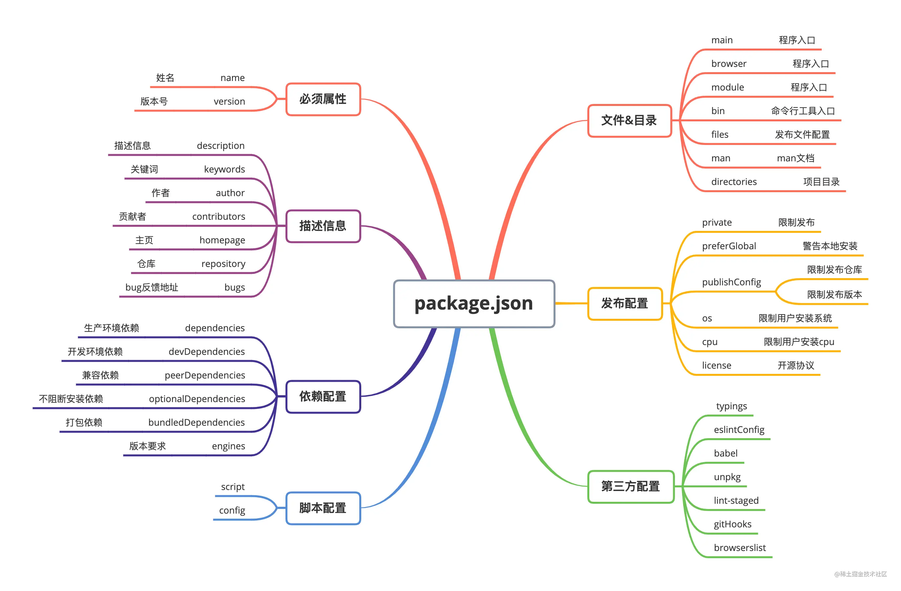

# package.json的关键字段



### 1. name

`package.json`文件中最重要的就是`name`和`version`字段，这两项是必填的。名称和版本一起构成一个标识符，该标识符被认为是完全唯一的。对包的更改应该与对版本的更改一起进行。

`name`必须小于等于214个字符，不能以`.`或`_`开头，不能有大写字母，因为名称最终成为URL的一部分因此不能包含任何非URL安全字符。 `npm`官方建议我们不要使用与核心节点模块相同的名称。不要在名称中加`js`或`node`。如果需要可以使用`engines`来指定运行环境。

该名称会作为参数传递给`require`，因此它应该是简短的，但也需要具有合理的描述性。

### 2. version

`version`一般的格式是`x.x.x`, 并且需要遵循该规则。

`package.json`文件中最重要的就是`name`和`version`字段，这两项是必填的。名称和版本一起构成一个标识符，该标识符被认为是完全唯一的。每次发布时`version`不能与已存在的一致。

### 3. files

`files`属性的值是一个数组，内容是模块下文件名或者文件夹名，如果是文件夹名，则文件夹下所有的文件也会被包含进来（除非文件被另一些配置排除了）

可以在模块根目录下创建一个`.npmignore`文件，写在这个文件里边的文件即便被写在`files`属性里边也会被排除在外，这个文件的写法与`.gitignore`类似。

### 4. main

`main`字段指定了加载的入口文件，`require`导入的时候就会加载这个文件。这个字段的默认值是模块根目录下面的`index.js`。

### 5. bin

`bin`项用来指定每个内部命令对应的可执行文件的位置。如果你编写的是一个node工具的时候一定会用到`bin`字段。

当我们编写一个`cli`工具的时候，需要指定工具的运行命令，比如常用的`webpack`模块，他的运行命令就是`webpack`。

```json
"bin": {
  "webpack": "bin/index.js",
}
```

当我们执行`webpack`命令的时候就会执行`bin/index.js`文件中的代码。

在模块以依赖的方式被安装，如果存在`bin`选项。在`node_modules/.bin/`生成对应的文件， `Npm`会寻找这个文件，在node_modules/.bin/目录下建立符号链接。由于node_modules/.bin/目录会在运行时加入系统的PATH变量，因此在运行npm时，就可以不带路径，直接通过命令来调用这些脚本。

所有node_modules/.bin/目录下的命令，都可以用npm run [命令]的格式运行。在命令行下，键入npm run，然后按tab键，就会显示所有可以使用的命令。

### 6. config

`config`字段用于添加命令行的环境变量。

```json
{
  "name" : "yindong",
  "config" : { "port" : "8080" },
  "scripts" : { "start" : "node server.js" }
}
```

在`server.js`脚本就可以引用`config`字段的值。

```js
console.log(process.env.npm_package_config_port); // 8080
```

用户可以通过`npm config set`来修改这个值。

```js
npm config set yindong:port 8000
```

### 7. dependencies、devDependencies

`dependencies`字段指定了项目运行所依赖的模块，`devDependencies`指定项目开发所需要的模块。

它们的值都是一个对象。该对象的各个成员，分别由模块名和对应的版本要求组成，表示依赖的模块及其版本范围。

当安装依赖的时候使用`--save`参数表示将该模块写入dependencies属性，`--save-dev`表示将该模块写入devDependencies属性。

```json
"devDependencies": {
        "webpack": "^5.38.1",
}
复制代码
```

对象的每一项通过一个键值对表示，前面是模块名称，后面是对应模块的版本号。版本号遵循“大版本.次要版本.小版本”的格式规定。

### 8. peerDependencies

当我们开发一个模块的时候，如果当前模块与所依赖的模块同时依赖一个第三方模块，并且依赖的是两个不兼容的版本时就会出现问题。

比如，你的项目依赖A模块和B模块的1.0版，而A模块本身又依赖B模块的2.0版。

大多数情况下，这不构成问题，B模块的两个版本可以并存，同时运行。但是，有一种情况，会出现问题，就是这种依赖关系将暴露给用户。

最典型的场景就是插件，比如A模块是B模块的插件。用户安装的B模块是1.0版本，但是A插件只能和2.0版本的B模块一起使用。这时，用户要是将1.0版本的B的实例传给A，就会出现问题。因此，需要一种机制，在模板安装的时候提醒用户，如果A和B一起安装，那么B必须是2.0模块。

`peerDependencies`字段，就是用来供插件指定其所需要的主工具的版本。可以通过`peerDependencies`字段来限制，使用myless模块必须依赖less模块的3.9.x版本.

```json
{
  "name": "myless",
  "peerDependencies": {
    "less": "3.9.x"
  }
}
```

### 9. optionalDependencies

如果一个依赖模块可以被使用， 同时你也希望在该模块找不到或无法获取时`npm`继续运行，你可以把这个模块依赖放到`optionalDependencies`配置中。这个配置的写法和`dependencies`的写法一样，不同的是这里边写的模块安装失败不会导致`npm install`失败。

### 10. private

如果这个属性被设置为`true`，`npm`将拒绝发布它，这是为了防止一个私有模块被无意间发布出去。

```json
"private": true
```