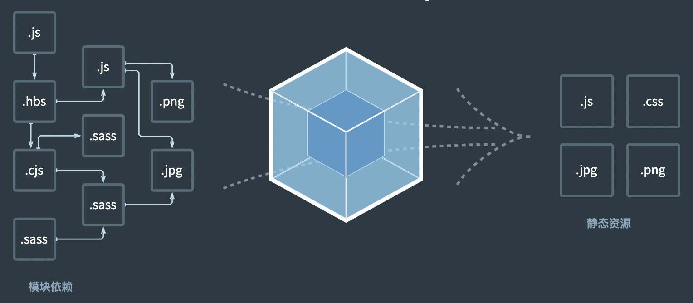

# webpack 打包原理

**webpack** 是一个用于现代 JavaScript 应用程序的 *静态模块打包工具*。当 webpack 处理应用程序时，它会在内部构建一个依赖图 ，此依赖图对应映射到项目所需的每个模块，并生成一个或多个 *bundle*。




## 一、简单的webpack配置

```js
const BabelLoader = require('./loaders/babelLoader')
const TestPlugin = require('./plugins/TestPlugin')
const resolve = dir => require('path').join(__dirname, dir)

module.exports = {
  // 入口文件地址
  entry: './src/index.js',
  // 输出文件地址
  output: {
    path: resolve('dist'),
    fileName: 'bundle.js'
  },
  // loader
  module: {
    rules: [
      {
        test: /\.(js|jsx)$/,
        // 编译匹配include路径的文件
        include: [
          resolve('src')
        ],
        use: {
          loader: BabelLoader // 通过Babel编译react代码
        }
      }
    ]
  },
  plugins: [
    new TestPlugin() // 一个测试plugin
  ]
}
```

通过上述简单的webpack配置中，能够了解到webpack的几个核心的配置：entry、output、module、plugins。这几个基本模块覆盖了webpack打包的基本原理。

`entry`：构建的入口，也是依赖树的起点，进入入口起点后，webpack 会找出有哪些模块和库是入口起点（直接和间接）依赖的。可以单个或多个起点。

`output`:  webpack 在哪里输出它所创建的 *bundle*，以及如何命名这些文件。

`module`：通过配置依赖匹配规则，结合相应的loader进行编译。**loader** 让 webpack 能够去处理其他类型的文件，并将它们转换为有效模块，以供应用程序使用，以及被添加到依赖图中。

`plugins`：插件可以将函数注册在webpack的生命周期钩子上，在生成最终文件之前可以对编译的结果做一些特殊的处理，例如模块分包、插入html文件等功能。

## 二、webpack构建流程


### 1. 构建配置信息

`Compiler` 类的构造方法里面收集用户传入的信息进行初始化。

```js
class Compiler {
  constructor(config, _callback) {
    const {
      entry,
      output,
      module,
      plugins
    } = config
    this.entryPath = entry
    this.distPath = output.path
    this.distName = output.fileName
    this.loaders = module.rules
    this.plugins = plugins
    this.root = process.cwd()
    this.compilation = {}
    this.entryId = getRootPath(this.root, entry, this.root)
  }
}
```

### 2. 注册生命周期

在构造函数中将所有的plugin挂载到实例的hooks属性中去。webpack的生命周期管理基于一个叫做 `tapable` 的库，通过这个库，我们可以创建一个发布订阅模型的钩子，然后通过将函数挂载到实例上（这些钩子事件的回调我们可以同步触发、异步触发甚至进行链式回调），在合适的时机触发钩子上的所有事件。例如我们在hooks上声明各个生命周期的钩子:

```js
const { AsyncSeriesHook } = require('tapable') // 此处我们创建了一些异步钩子
constructor(config, _callback) {
  ...
  this.hooks = {
    // 生命周期事件
    beforeRun: new AsyncSeriesHook(['compiler']), // compiler代表我们将向回调事件中传入一个compiler参数
    afterRun: new AsyncSeriesHook(['compiler']),
    beforeCompile: new AsyncSeriesHook(['compiler']),
    afterCompile: new AsyncSeriesHook(['compiler']),
    emit: new AsyncSeriesHook(['compiler']),
    failed: new AsyncSeriesHook(['compiler']),
  }
  this.mountPlugin()
}
// 注册所有的plugin
mountPlugin() {
  for(let i=0;i<this.plugins.length;i++) {
    const item = this.plugins[i]
    if ('apply' in item && typeof item.apply === 'function') {
      // 注册各生命周期钩子的发布订阅监听事件
      item.apply(this)
    }
  }
}
// 当运行run方法的逻辑之前
run() {
  // 在特定的生命周期发布消息，触发对应的订阅事件
  this.hooks.beforeRun.callAsync(this) // this作为参数传入，对应之前的compiler
  ...
}
```

### 3.编译

声明一个 `Compilation` 类，这个类主要是执行编译工作。

1. 从`entry`读取代码。
2. 从配置中的`module`找到匹配的loader，执行loader返回相应的代码。
3. 通过`@babel/parser`将步骤二的代码，转成ast语法，分析代码中引用的外部依赖，并收集依赖，通过`@babel/generator`把ast语法转化为原代码。
4. 把步骤三收集的依赖重复2-3-4步骤。（忽略循环引用的问题）

```js
module.exports = class Compilation {
  constructor(props) {
    const {
      entry,
      root,
      loaders,
      hooks,
      distPath,
      distName
    } = props
    this.entry = entry
    this.root = root
    this.loaders = loaders
    this.hooks = hooks
    this.distPath = distPath
    this.assets = {}
  }
  // 入口路径
  entry = ''

  // 存放处理完毕的模块代码Map
  moduleMap = {}

  // 开始编译
  async make() {
    await this.moduleWalker(this.entry)
  }
  

  // 根据依赖将所有被引用过的文件都进行编译
  async moduleWalker(sourcePath) {
    if (sourcePath in this.moduleMap) return
    // 在读取文件时，我们需要完整的以.js结尾的文件路径
    sourcePath = completeFilePath(sourcePath)
    const [ sourceCode, md5Hash ] = await this.loaderParse(sourcePath)
    const modulePath = getRootPath(this.root, sourcePath, this.root)
    // 获取模块编译后的代码和模块内的依赖数组
    const [ moduleCode, relyInModule ] = this.parse(sourceCode, path.dirname(modulePath))
    // 将模块代码放入ModuleMap
    this.moduleMap[modulePath] = moduleCode
    this.assets[modulePath] = md5Hash
    // 再依次对模块中的依赖项进行解析
    for(let i=0;i<relyInModule.length;i++) {
      await this.moduleWalker(relyInModule[i], path.dirname(relyInModule[i]))
    }
    console.log(this.assets)
  }

  // 生成源代码
  async loaderParse(entryPath) {
    // 用utf8格式读取文件内容
    let [ content, md5Hash ] = await readFileWithHash(entryPath)
    // 获取用户注入的loader
    const { loaders } = this
    // 依次遍历所有loader
    for(let i=0;i<loaders.length;i++) {
      const loader = loaders[i]
      const { test : reg, use } = loader
      if (entryPath.match(reg)) {
        // 判断是否满足正则或字符串要求
        // 如果该规则需要应用多个loader,从最后一个开始向前执行
        if (Array.isArray(use)) {
          while(use.length) {
            const cur = use.pop()
            const loaderHandler = 
              typeof cur.loader === 'string' 
              // loader也可能来源于package包例如babel-loader
              // 但是这里并不可以用babel-loader,因为babel-loader需要在webpack提前生成的上下文中才能正常运行
                ? require(cur.loader)
                : (
                  typeof cur.loader === 'function'
                  ? cur.loader : _ => _
                )
            content = loaderHandler(content)
          }
        } else if (typeof use.loader === 'string') {
          const loaderHandler = require(use.loader)
          content = loaderHandler(content)
        } else if (typeof use.loader === 'function') {
          const loaderHandler = use.loader
          content = loaderHandler(content)
        }
      }
    }
    return [ content, md5Hash ]
  }

  /**
   * 将某个节点的name和arguments转换成目标
   */
  convertNode = (node, dirpath, relyInModule) => {
    node.callee.name = '__webpack_require__'
    // 参数字符串名称，例如'react', './MyName.js'
    let moduleName = node.arguments[0].value
    // 生成依赖模块相对【项目根目录】的路径
    let moduleKey = completeFilePath(getRootPath(dirpath, moduleName, this.root))
    // 收集module数组
    relyInModule.push(moduleKey)
    // 替换__webpack_require__的参数字符串，因为这个字符串也是对应模块的moduleKey,需要保持统一
    // 因为ast树中的每一个元素都是babel节点，所以需要使用'@babel/types'来进行生成
    node.arguments = [ types.stringLiteral(moduleKey) ]
  }

  // 解析源码，替换其中的require方法来构建ModuleMap
  parse(source, dirpath) {
    const inst = this
    const ast = parser.parse(source)
    const relyInModule = [] // 获取文件依赖的所有模块
    traverse(ast, {
      // 删除所有的注释节点
      // enter(p) {
      //   if (p.node.leadingComments) {
      //     p.node.leadingComments = undefined
      //   }
      //   if (p.node.trailingComments) {
      //     p.node.trailingComments = undefined
      //   }
      // },
      // 检索所有的词法分析节点,当遇到函数调用表达式的时候执行,对ast树进行改写
      CallExpression(p) {
        // 有些require是被_interopRequireDefault包裹的
        // 所以需要先找到_interopRequireDefault节点
        if (p.node.callee && p.node.callee.name === '_interopRequireDefault') {
          const innerNode = p.node.arguments[0]
          if (innerNode.callee.name === 'require') {
            inst.convertNode(innerNode, dirpath, relyInModule)
          }
        } else if (p.node.callee.name === 'require') {
          inst.convertNode(p.node, dirpath, relyInModule)
        }
      }
    })
    // 将改写后的ast树重新组装成一份新的代码, 并且和依赖项一同返回
    const moduleCode = generator(ast).code
    return [ moduleCode, relyInModule ]
  }
}
```

### 4. 输出bundle

经过编译后，就需要把编译后的代码，打包成一个bundle。观察dist生成的文件的话，会发现打包出来的样子是一个立即执行函数，主函数体是一个闭包，闭包中缓存了已经加载的模块 `installedModules` ，以及定义了一个 `__webpack_require__` 函数，最终返回的是函数入口所对应的模块。而函数的参数则是各个模块的key-value所组成的对象。

```js
 /**
   * 发射文件,生成最终的bundle.js
   */
  emitFile() { // 发射打包后的输出结果文件
    // 首先对比缓存判断文件是否变化
    const assets = this.compilation.assets
    const pastAssets = this.getStorageCache()
    if (loadsh.isEqual(assets, pastAssets)) {
      // 如果文件hash值没有变化，说明无需重写文件
      // 只需要依次判断每个对应的文件是否存在即可
      // 这一步省略！
    } else {
      // 缓存未能命中
      // 获取输出文件路径
      const outputFile = path.join(this.distPath, this.distName);
      // 获取输出文件模板
      // const templateStr = this.generateSourceCode(path.join(__dirname, '..', "bundleTemplate.ejs"));
      const templateStr = fs.readFileSync(path.join(__dirname, '..', "template.ejs"), 'utf-8');
      // 渲染输出文件模板
      const code = ejs.render(templateStr, {entryId: this.entryId, modules: this.compilation.moduleMap});
      
      this.assets = {};
      this.assets[outputFile] = code;
      // 将渲染后的代码写入输出文件中
      fs.writeFile(outputFile, this.assets[outputFile], function(e) {
        if (e) {
          console.log('[Error] ' + e)
        } else {
          console.log('[Success] 编译成功')
        }
      });
    //   将缓存信息写入缓存文件
      fs.writeFileSync(resolve(this.distPath, 'manifest.json'), JSON.stringify(this.assets, null, 2))
    }
  }
}
```

## 三、总结

以上就是关于webpack打包原理的实现，具体实现跟webpack细节有很多不同。代码地址：https://github.com/Peroluo/jerkpack

