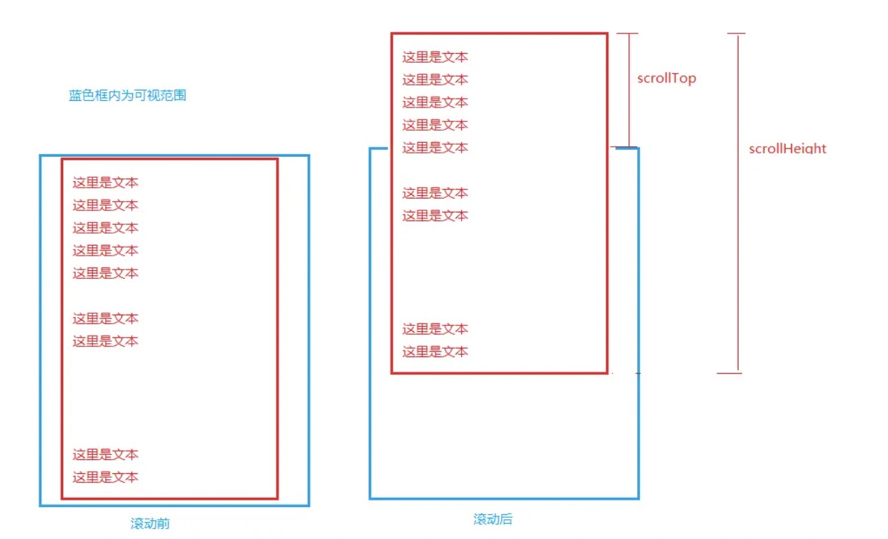

# JS 的那些度量

### 一、OffsetTop、OffsetLeft

相对于父级节点的距离

### 二、offsetWidth、offsetHeight

**offsetHeight || offsetWidth = boder + padding + content（不包括margin）**

### 三、clientWidth和clientHeight

**只读属性**，返回当前节点的**可视宽度**和**可视高度**（不包括边框、外边距）（包括内边距）clientHeight = topPadding + bottomPadding+ height - scrollbar.height。

### 四、scrollTop、scrollLeft、scrollWidth、scrollHeight

### 五、event.clientX、event.clientY、event.pageX、event.pageY

event.clientX /event.clientY是目标点距离浏览器可视范围的X轴/Y轴坐标

event.pageX /event.pageY 是目标点距离document最左上角的X轴/Y轴坐标

### 六、innerHeight/innerWidth和outerHeight/outerWidth

innerHeight/innerWidth为**只读属性**，返回窗口文档显示区的高度和宽度，不包括菜单栏、工具栏和滚动条的宽高。（ 注：IE不支持这些属性，它用document.documentElement 或document.body 的 clientWidth和 clientHeight属性作为替代。）

outerHeight/outerWidth为**可读写属性**，设置或返回一个窗口的高度和宽度，包括所有界面元素（如工具栏/滚动条）。
