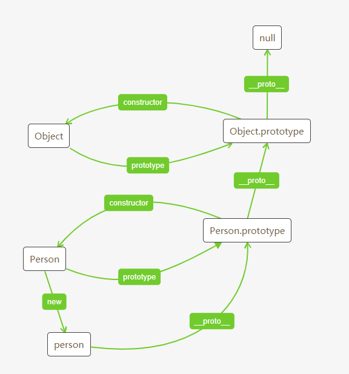

# 原型链

### 对象的三角关系
每一个构造函数都有一个原型对象prototype

原型对象都包含一个指向构造函数的 constructor 属性

每一个实例都包含一个指向原型对象的 __proto__ 指针， instance.__proto__ == Instance.prototype;

```js
function Person(){}

const person = new Person()

Person.prototype.constructor === Person // true

person.__proto__ === Person.prototype // true

```


### 对象继承

#### 1. 原型继承
```js
function Person(){}

function Son(){
    this.color=["red"];
}

Son.prototype=new Person();
```

**缺点：**
1. 无法给父类的构造函数传递参数
2. 来自原型对象的引用属性是所有实例共享的
3. 无法实现多继承

### 2. 构造继承

```js
function Son(){
    Person.call(this); //核心
}
```
**优点：**
1. 不会出现实例之间相互影响的问题
2. 可以向父类传参
3. 可以实现多继承
**缺点：**
1. 只继承了父类的构造函数属性，并没有继承父类的原型属性(对于有原型属性的父类，无法使用此种继承)
2. 无法实现构造函数的复用

### 3. 完美的继承方案
```js

function Parent(name){
  this.name = name;
  this.type = 'ff';
}
Parent.prototype.say = function() {
  console.log(this.name);
};

function extends(Child, Parent, ...args){
  Child.prototype = Object.create(Parent.prototype);

  Child.prototype.constructor = Child;

  Child.super = Parent;

  if(Object.setPrototypeOf){
    Object.setPrototypeOf(Child, Parent);
  }else if(Child._proto_){
    Child._proto_ = Parent;
  }else{
    for(const k in Parent){
      if(Parent.hasOwnPropertty(k) && !(k in Child)){
        Child[k] = Parent[k];
      }
    }
  }

  return new Child(...args);;
}

function Student(name){
  this.isStudent = true;
  Parent.call(this, name);
}
const stu = extends(Student, Parent, '小明222');

stu.say();
```