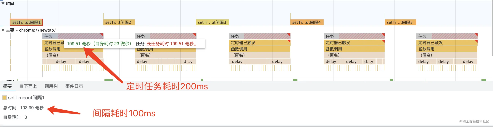
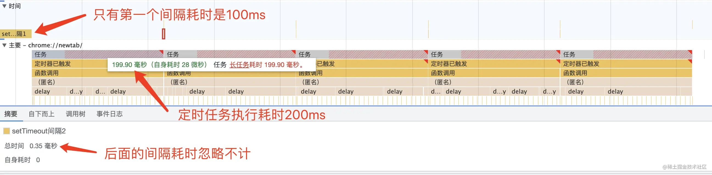

# setTimeout 与 setInterval 区别

setInterval加入事件队列的时间是固定的，setTimeout加入事件队列的时间是执行耗时 + 间隔耗时。 setInterval任务间的间隔是 Math.max(执行耗时, 间隔耗时)，setTimeout任务间的间隔是固定的。

## setTimeout

```js
let index = 1
const delay = () => {
    const now = Date.now()
    while(Date.now() - now < 200);
}
const start = () => {
    setTimeout(() => {
        // 为了方便在性能看板观察间隔时长
        performance.measure(`setTimeout间隔${index}`, `setTimeout间隔${index}`)
        
        // 耗时操作200ms
        delay()   
        
        if(index++ >= 5) {            
            return
        }
       
        performance.mark(`setTimeout间隔${index}`)  
        // 递归调用
        start()
    }, 100)
}
performance.mark(`setTimeout间隔${index}`)
start()
```


## setInterval
```js
let index = 1
const delay = () => {
    const now = Date.now()
    while(Date.now() - now < 200);
}
const start = () => {
    const ticker = setInterval(() => {
        // 为了方便在性能看板观察间隔时长
        performance.measure(`setTimeout间隔${index}`, `setTimeout间隔${index}`)
        
        // 耗时操作200ms
        delay() 
        
        if(index++ >= 5) {            
            clearInterval(ticker)
            return
        }
       
        performance.mark(`setTimeout间隔${index}`)
    }, 100)
}
performance.mark(`setTimeout间隔${index}`)
start()
```

发现除了第一个间隔是100ms，后面其他间隔的耗时都可以忽略不计，定时器出现一个连续执行的现象，每一个周期的总耗时是200ms，也就是Math.max(执行耗时, 间隔耗时)，当执行耗时大于间隔耗时，间隔失效连续执行。

js在单线程环境中执行，定时任务在指定时间加入事件队列，等待主线程空闲时，事件队列中的任务再加入执行栈执行。setInterval回调函数加入事件队列的时间点是固定的，当队列中存在重复的定时任务会进行丢弃。比如上面的例子，理论上每100ms会往事件队列中加入定时任务，由于每个周期主线程执行耗时是200ms，期间可以加入两个定时任务，由于第二个定时任务加入时，第一个定时任务还在事件队列中，重复的定时任务会被丢弃，200ms后主线程空闲，事件队列中只有一个定时任务，会立刻加入执行栈由主线程执行，由于定时任务的执行耗时大于间隔耗时，每次主线程执行完定时任务，事件队列中总会有一个新的任务在等待，所以出现了连续执行。而setTimeout的定时任务依赖上一次定时任务执行结束再调用定时器，所以定时任务之间的间隔是固定的，但是整个定时任务的周期会大于设置的间隔时长。
