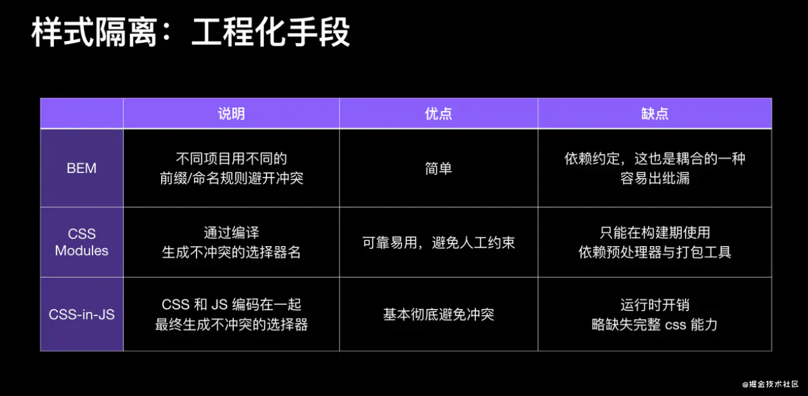

# CSS 隔离

### 一、 动态样式表


### 二、工程化编译



### 三、Shadow DOM

```js
function openShadow(domNode) {
  var shadow = domNode.attachShadow({ mode: "open" });
  shadow.innerHTML = domNode.innerHTML;
  domNode.innerHTML = "";
}
var bodyNode = document.getElementsByTagName("body")[0];
openShadow(bodyNode);
```

- 优点

1. 完全隔离 CSS 样式

- 缺点

1. 在使用一些弹窗组件的时候（弹窗很多情况下都是默认添加到了 document.body ）这个时候它就跳过了阴影边界，跑到了主应用里面，样式就丢了