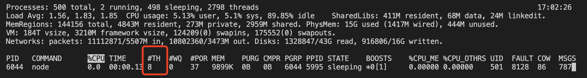
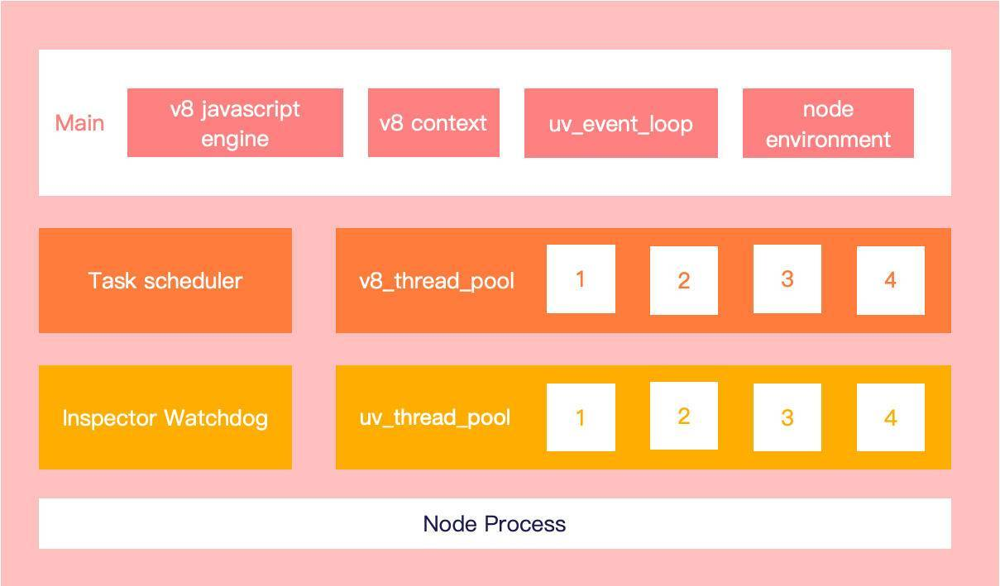

# Node 进程与线程

进程是一个具有一定独立功能的程序在一个数据集上的一次动态执行的过程，是操作系统进行资源分配和调度的一个独立单位，是应用程序运行的载体。

线程是程序执行中一个单一的顺序控制流，它存在于进程之中，是比进程更小的能独立运行的基本单位。

早期在单核 CPU 的系统中，为了实现多任务的运行，引入了进程的概念，不同的程序运行在数据与指令相互隔离的进程中，通过时间片轮转调度执行，由于 CPU 时间片切换与执行很快，所以看上去像是在同一时间运行了多个程序。

由于进程切换时需要保存相关硬件现场、进程控制块等信息，所以系统开销较大。为了进一步提高系统吞吐率，在同一进程执行时更充分的利用 CPU 资源，引入了线程的概念。线程是操作系统调度执行的最小单位，它们依附于进程中，共享同一进程中的资源，基本不拥有或者只拥有少量系统资源，切换开销极小。

### Node 是单线程？

Node 严格意义讲并非只有一个线程，通常说的 “Node 是单线程” 其实是指 JS 的执行主线程只有一个

```js
require('http').createServer((req, res) => {
  res.writeHead(200);
  res.end('Hello World');
}).listen(8000);
console.log('process id', process.pid);
```
```shell
top -pid 6044
```


#TH (threads 线程) 这一列显示此进程中包含 8 个线程，说明 Node 进程中并非只有一个线程。事实上一个 Node 进程通常包含：1 个 Javascript 执行主线程；1 个 watchdog 监控线程用于处理调试信息；1 个 v8 task scheduler 线程用于调度任务优先级，加速延迟敏感任务执行；4 个 v8 线程（可参考以下代码），主要用来执行代码调优与 GC 等后台任务；以及用于异步 I / O 的 libuv 线程池。

**Node进程结构图**


### 子进程

child_process 模块提供了 4 种异步创建 Node 进程的方法，具体可参考 child_process API。
1. spawn 以主命令加参数数组的形式创建一个子进程，子进程以流的形式返回 data 和 error 信息。
2. exec 是对 spawn 的封装，可直接传入命令行执行，以 callback 形式返回 error stdout stderr 信息
3. execFile 类似于 exec 函数，但默认不会创建命令行环境，将直接以传入的文件创建新的进程，性能略微优于 exec
4. fork 是 spawn 的特殊场景，只能用于创建 node 程序的子进程，默认会建立父子进程的 IPC 信道来传递消息

#### 进程通信
在 Linux 系统中，可以通过管道、消息队列、信号量、共享内存、Socket 等手段来实现进程通信。在 Node 中，父子进程可通过 IPC(Inter-Process Communication) 信道收发消息，IPC 由 libuv 通过管道 pipe 实现。一旦子进程被创建，并设置父子进程的通信方式为 IPC（参考 stdio 设置），父子进程即可双向通信。

进程之间通过 process.send 发送消息，通过监听 message 事件接收消息。当一个进程发送消息时，会先序列化为字符串，送入 IPC 信道的一端，另一个进程在另一端接收消息内容，并且反序列化，因此我们可以在进程之间传递对象。

### Demo child_process
```js
# 主进程
const { fork } = require('child_process');
const child = fork('./fib.js'); // 创建子进程
child.send({ num: 44 }); // 将任务执行数据通过信道发送给子进程
child.on('message', message => {
  console.log('receive from child process, calculate result: ', message.data);
  child.kill();
});
child.on('exit', () => {
  console.log('child process exit');
});
setInterval(() => { // 主进程继续执行
  console.log('continue excute javascript code', new Date().getSeconds());
}, 1000);
```
```js
# 子进程 fib.js
// 接收主进程消息，计算斐波那契数列第 N 项，并发送结果给主进程
// 计算斐波那契数列第 n 项
function fib(num) {
  if (num === 0) return 0;
  if (num === 1) return 1;
  return fib(num - 2) + fib(num - 1);
}
process.on('message', msg => { // 获取主进程传递的计算数据
  console.log('child pid', process.pid);
  const { num } = msg;
  const data = fib(num);
  process.send({ data }); // 将计算结果发送主进程
});
// 收到 kill 信息，进程退出
process.on('SIGHUP', function() {
  process.exit();
});
```
```shell
## 执行结果
child pid 39974
continue excute javascript code 41
continue excute javascript code 42
continue excute javascript code 43
continue excute javascript code 44
receive from child process, calculate result:  1134903170
child process exit
```
### cluster 集群模式
为了更加方便的管理进程、负载均衡以及实现端口复用，Node 在 v0.6 之后引入了 cluster 模块（官方文档），相对于子进程模块，cluster 实现了单 master 主控节点和多 worker 执行节点的通用集群模式。cluster master 节点可以创建销毁进程并与子进程通信，子进程之间不能直接通信；worker 节点则负责执行耗时的任务。

cluster 模块同时实现了负载均衡调度算法，在类 unix 系统中，cluster 使用轮转调度（round-robin），node 中维护一个可用 worker 节点的队列 free，和一个任务队列 handles。当一个新的任务到来时，节点队列队首节点出队，处理该任务，并返回确认处理标识，依次调度执行。而在 win 系统中，Node 通过 Shared Handle 来处理负载，通过将文件描述符、端口等信息传递给子进程，子进程通过信息创建相应的 SocketHandle / ServerHandle，然后进行相应的端口绑定和监听，处理请求
```js
# 计算斐波那契数列第 43 / 44 项
const cluster = require('cluster');
// 计算斐波那契数列第 n 项
function fib(num) {
  if (num === 0) return 0;
  if (num === 1) return 1;
  return fib(num - 2) + fib(num - 1);
}
if (cluster.isMaster) { // 主控节点逻辑
  for (let i = 43; i < 45; i++) {
    const worker = cluster.fork() // 启动子进程
    // 发送任务数据给执行进程，并监听子进程回传的消息
    worker.send({ num: i });
    worker.on('message', message => {
      console.log(`receive fib(${message.num}) calculate result ${message.data}`)
      worker.kill();
    });
  }

  // 监听子进程退出的消息，直到子进程全部退出
  cluster.on('exit', worker => {
    console.log('worker ' + worker.process.pid + ' killed!');
    if (Object.keys(cluster.workers).length === 0) {
      console.log('calculate main process end');
    }
  });
} else {
  // 子进程执行逻辑
  process.on('message', message => { // 监听主进程发送的信息
    const { num } = message;
    console.log('child pid', process.pid, 'receive num', num);
    const data = fib(num);
    process.send({ data, num }); // 将计算结果发送给主进程
  })
}
```
```shell
child pid 6745 receive num 43
child pid 6746 receive num 44
receive fib(43) calculate result 433494437
worker 6745 killed!
receive fib(44) calculate result 701408733
worker 6746 killed!
calculate main process end
```
### worker_threads 工作线程
在 Node v10 以后，为了减小 CPU 密集型任务计算的系统开销，引入了新的特性：工作线程 worker_threads（官方文档）。通过 worker_threads 可以在进程内创建多个线程，主线程与 worker 线程使用 parentPort 通信，worker 线程之间可通过 MessageChannel 直接通信。

```js
const { Worker, isMainThread, parentPort } = require('worker_threads');
// 计算斐波那契数列第 n 项
function fib(num) {
  if (num === 0) return 0;
  if (num === 1) return 1;
  return fib(num - 2) + fib(num - 1);
}
if (isMainThread) { // 主线程执行函数
  const worker = new Worker(__filename);
  worker.once('message', (message) => {
    const { num, result } = message;
    console.log(`Fibonacci(${num}) is ${result}`);
    process.exit();
  });
  worker.postMessage(43);
  console.log('start calculate Fibonacci');
  // 继续执行后续的计算程序
  setInterval(() => {
    console.log(`continue execute code ${new Date().getSeconds()}`);
  }, 1000);
} else { // 子线程执行函数
  parentPort.once('message', (message) => {
    const num = message;
    const result = fib(num);
    // 子线程执行完毕，发消息给父线程
    parentPort.postMessage({
      num,
      result
    });
  });
}
```

```shell
start calculate Fibonacci
continue execute code 8
continue execute code 9
continue execute code 10
continue execute code 11
Fibonacci(43) is 433494437
```