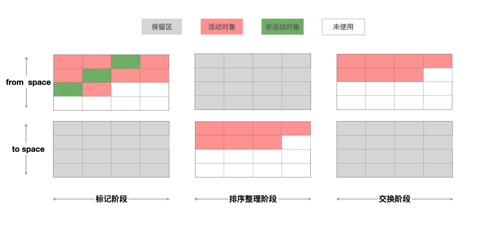

# Chrome 垃圾回收算法

在大多数场景下，很多对象在一次垃圾回收之后，就会被清理掉后释放内存，少部分对象会一直保持活跃。于是 V8 引擎为了提高回收率，将堆分为新生代和老生代。

新生代区域的容量只有1-8M，而老生代区的容量就大很多。对于这两块区域，V8 分别使用两个不同的垃圾回收器，分别是：

* 副垃圾回收器 - Scavenge：负责新生代的垃圾回收。
* 主垃圾回收器 - Mark-Sweep & Mark-Compact：负责老生代的垃圾回收。

## 新生代垃圾回收器 - Scavenge

Scavenge 算法适用于空间占用不大的场景，以空间换取时间。将新生代分为from-space和to-space两部分，将from-space中存活的活动对象复制到to-space`中有序排列，然后释放 from-space 的非活动对象内存，完成后再把 from-space 和 to-space 进行互换，具体可以查看下图

### 怎么区分对象是活动对象和非活动对象
根据对象的可达性，**V8 引擎从根对象（window，global）的指针开始**，向下搜索其子节点，被搜索到的子节点说明该节点的引用对象可达，并为其留下标记，然后递归这个搜索的过程，直到所有子节点都被遍历结束，那么没有被标记的对象节点，说明该对象没有被任何地方引用，可以证明这是一个需要被释放内存的对象，可以被垃圾回收器回收。

### 新生代中如何晋升为老生代对象
在新生代中的对象，分为 nursery 子代和intermediate子代两个区域，一个对象第一次分配内存时会被分配到新生代中的nursery子代，如果进过下一次垃圾回收这个对象还存在新生代中，这时候我们移动到 intermediate 子代，再经过下一次垃圾回收，如果这个对象还在新生代中，副垃圾回收器会将该对象移动到老生代中，这个移动的过程被称为晋升。

## 老生代垃圾回收算法 - Mark-Sweep & Mark-Compact

**标记清除**
标记清除算法有两个阶段，标记阶段和清理阶段，看起来与 Scavenge 类似，不同的是，Scavenge 算法是复制活动对象，而由于在老生代中活动对象占大多数，所以 Mark-Sweep 在标记了活动对象和非活动对象之后，直接把非活动对象清除。

* 标记阶段：对老生代进行第一次扫描，标记活动对象
* 清理阶段：对老生代进行第二次扫描，清除未被标记的对象，即清理非活动对象

**标记整理**
上面标记清除后，老生代的内存中产生了很多内存碎片，若不清理这些内存碎片，如果出现需要分配一个大对象的时候，这时所有的碎片空间都完全无法完成分配，就会提前触发垃圾回收，而这次回收其实不是必要的。

为了解决内存碎片问题，标记整理添加了对活动对象整理阶段，将所有的活动对象往一端移动，移动完成后，直接清理掉边界外的内存。

## V8 当前垃圾回收机制
现代的浏览器都支持并发标记（Concurrent），在并发的基础上添加并行（Parallel）技术，使得垃圾回收时间大幅度缩短。

### 副垃圾回收器

V8 在新生代垃圾回收中，使用并行机制，在整理排序阶段，也就是将活动对象从from-to复制到space-to的时候，启用多个辅助线程，并行的进行整理。由于多个线程竞争一个新生代的堆的内存资源，可能出现有某个活动对象被多个线程进行复制操作的问题，为了解决这个问题，V8 在第一个线程对活动对象进行复制并且复制完成后，都必须去维护复制这个活动对象后的指针转发地址，以便于其他协助线程可以找到该活动对象后可以判断该活动对象是否已被复制。

### 主垃圾回收器

V8 在老生代垃圾回收中，如果堆中的内存大小超过某个阈值之后，会启用并发标记任务。每个辅助线程都会去追踪每个标记到的对象的指针以及对这个对象的引用，而在 Javascript 代码执行时候，并发标记也在后台的辅助进程中进行，当堆中的某个对象指针被 Javascript 代码修改的时候，写入屏障技术会在辅助线程在进行并发标记的时候进行追踪。

当并发标记完成或者动态分配的内存到达极限的时候，主线程会执行最终的快速标记步骤，这个时候主线程会挂起，主线程会再一次的扫描根集以确保所有的对象都完成了标记，由于辅助线程已经标记过活动对象，主线程的本次扫描只是进行 check 操作，确认完成之后，某些辅助线程会进行清理内存操作，某些辅助进程会进行内存整理操作，由于都是并发的，并不会影响主线程 Javascript 代码的执行。

