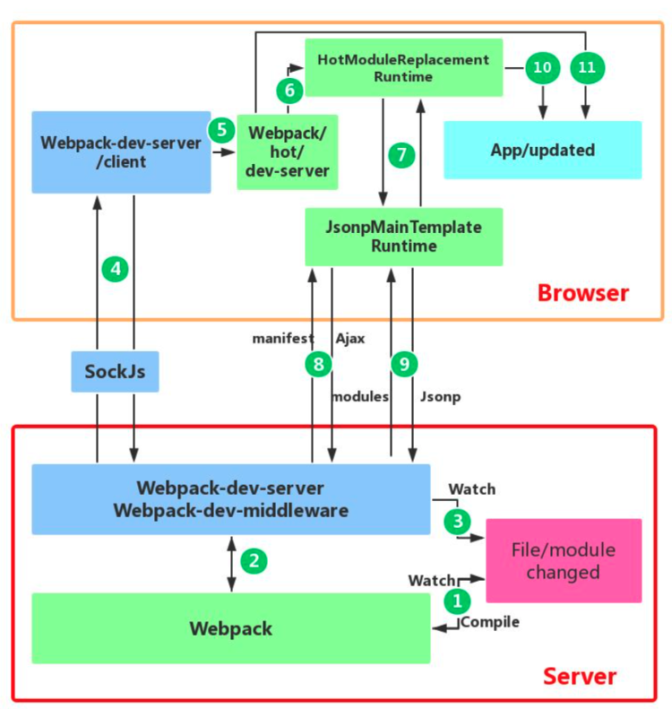

# 热更新原理
github地址：https://github.com/luoguoxiong/webpack-hmr
## 热更新图解



1. 在 webpack 的 watch 模式下，文件系统中某一个文件发生修改，webpack 监听到文件变化，根据配置文件对模块重新编译打包，并将打包后的代码通过简单的 JavaScript 对象保存在内存中。
2. webpack-dev-server 和 webpack 之间的接口交互，而在这一步，主要是 dev-server 的中间件 webpack-dev-middleware 和 webpack 之间的交互，webpack-dev-middleware 调用 webpack 暴露的 API对代码变化进行监控，并且告诉 webpack，将代码打包到内存中。
3. webpack-dev-server 对文件变化的一个监控，这一步不同于第一步，并不是监控代码变化重新打包。当我们在配置文件中配置了devServer.watchContentBase 为 true 的时候，Server 会监听这些配置文件夹中静态文件的变化，变化后会通知浏览器端对应用进行 live reload。注意，这儿是浏览器刷新，和 HMR 是两个概念。
4. webpack-dev-server 代码的工作，该步骤主要是通过 sockjs（webpack-dev-server 的依赖）在浏览器端和服务端之间建立一个 websocket 长连接，将 webpack 编译打包的各个阶段的状态信息告知浏览器端，同时也包括第三步中 Server 监听静态文件变化的信息。浏览器端根据这些 socket 消息进行不同的操作。当然服务端传递的最主要信息还是新模块的 hash 值，后面的步骤根据这一 hash 值来进行模块热替换。
5. webpack-dev-server/client 端并不能够请求更新的代码，也不会执行热更模块操作，而把这些工作又交回给了 webpack，webpack/hot/dev-server 的工作就是根据 webpack-dev-server/client 传给它的信息以及 dev-server 的配置决定是刷新浏览器呢还是进行模块热更新。当然如果仅仅是刷新浏览器，也就没有后面那些步骤了。
6. HotModuleReplacement.runtime 是客户端 HMR 的中枢，它接收到上一步传递给他的新模块的 hash 值，它通过 JsonpMainTemplate.runtime 向 server 端发送 Ajax 请求，服务端返回一个 json，该 json 包含了所有要更新的模块的 hash 值，获取到更新列表后，该模块再次通过 jsonp 请求，获取到最新的模块代码。这就是上图中 7、8、9 步骤。
7. 而第 10 步是决定 HMR 成功与否的关键步骤，在该步骤中，HotModulePlugin 将会对新旧模块进行对比，决定是否更新模块，在决定更新模块后，检查模块之间的依赖关系，更新模块的同时更新模块间的依赖引用。
8. 最后一步，当 HMR 失败后，回退到 live reload 操作，也就是进行浏览器刷新来获取最新打包代码。

## 服务端简易实现
### 1. 导入依赖
```js
const path = require('path') // 解析文件路径
const express = require('express') // 启动本地服务
const mime = require('mime') // 获取文件类型 实现一个静态服务器
const webpack = require('webpack') // 读取配置文件进行打包
const MemoryFileSystem = require('memory-fs') // 使用内存文件系统更快，文件生成在内存中而非真实文件
const config = require('./webpack.config') // 获取webpack配置文件
const compiler = webpack(config)
```
### 2. 创建server服务
添加webpack的done事件回调
```js
class Server {
  constructor(compiler) {
    this.compiler = compiler
    let sockets = []
    let lasthash
    this.server = require('http').createServer(app)
    compiler.hooks.done.tap('webpack-dev-server', (stats) => {
      lasthash = stats.hash
      // 每当新一个编译完成后都会向客户端发送消息
      sockets.forEach(socket => {
        socket.emit('hash', stats.hash) // 先向客户端发送最新的hash值
        socket.emit('ok') // 再向客户端发送一个ok
      })
    })
  }
  listen(port) {
    this.server.listen(port, () => {
      console.log(`服务器已经在${port}端口上启动了`)
    })
  }
}
let server = new Server(compiler)
server.listen(8000)
```
webpack编译后提供提供了一系列钩子函数，以供插件能访问到它的各个生命周期节点，并对其打包内容做修改。compiler.hooks.done则是插件能修改其内容的最后一个节点。

编译完成通过socket向客户端发送消息，推送每次编译产生的hash。另外如果是热更新的话，还会产出二个补丁文件，里面描述了从上一次结果到这一次结果都有哪些chunk和模块发生了变化。

使用let sockets = []数组去存放当打开了多个Tab时每个Tab的socket实例。
### 3.添加webpack-dev-middleware中间件
```js
  function middleware(req, res, next) {
    if (req.url === '/favicon.ico') {
      return res.sendStatus(404)
    }
    // /index.html   dist/index.html
    let filename = path.join(config.output.path, req.url.slice(1))
    let stat = fs.statSync(filename)
    if (stat.isFile()) { // 判断是否存在这个文件,如果在的话直接把这个读出来发给浏览器
      let content = fs.readFileSync(filename)
      let contentType = mime.getType(filename)
      res.setHeader('Content-Type', contentType)
      res.statusCode = res.statusCode || 200
      res.send(content)
    } else {
      return res.sendStatus(404)
    }
  }
  app.use(middleware)
  ```
  使用expres启动了本地开发服务后，使用中间件去为其构造一个静态服务器，并使用了内存文件系统，使读取文件后存放到内存中，提高读写效率，最终返回生成的文件。
  ### 4. 使用sockjs在浏览器端和服务端之间建立一个 websocket 长连接
  ```js
    constructor(compiler) {
    // ...
    this.server = require('http').createServer(app)
    let io = require('socket.io')(this.server)
    io.on('connection', (socket) => {
      sockets.push(socket)
      socket.emit('hash', lastHash)
      socket.emit('ok')
    })
  }
  ```
启动一个 websocket服务器，然后等待连接来到，连接到来之后存进sockets池

当有文件改动，webpack重新编译时，向客户端推送hash和ok两个事件

## 客户端简易实现

webpack-dev-server/client端会监听到此hash消息

在开发客户端功能之前，需要在src/index.html中引入socket.io

```js
<script src="/socket.io/socket.io.js"></script>

let socket = io('/')
socket.on('connect', onConnected)
const onConnected = () => {
  console.log('客户端连接成功')
}
let hotCurrentHash // lastHash 上一次 hash值 
let currentHash // 这一次的hash值
socket.on('hash', (hash) => {
  currentHash = hash
})
socket.on('ok', () => {
  reloadApp(true)
})
```
eloadApp中判断是否支持热更新
```js
// 当收到ok事件后，会重新刷新app
function reloadApp(hot) {
  if (hot) { // 如果hot为true 走热更新的逻辑
    hotEmitter.emit('webpackHotUpdate')
  } else { // 如果不支持热更新，则直接重新加载
    window.location.reload()
  }
}
```
在reloadApp中会进行判断，是否支持热更新，如果支持的话发射webpackHotUpdate事件，如果不支持则直接刷新浏览器。

在webpack/hot/dev-server.js会监听webpackHotUpdate事件
首先需要一个发布订阅去绑定事件并在合适的时机触发。

```js
class Emitter {
  constructor() {
    this.listeners = {}
  }
  on(type, listener) {
    this.listeners[type] = listener
  }
  emit(type) {
    this.listeners[type] && this.listeners[type]()
  }
}
let hotEmitter = new Emitter()
hotEmitter.on('webpackHotUpdate', () => {
  if (!hotCurrentHash || hotCurrentHash == currentHash) {
    return hotCurrentHash = currentHash
  }
  hotCheck()
})
```
在check方法里会调用module.hot.check方法
```js
function hotCheck() {
  hotDownloadManifest().then(update => {
    let chunkIds = Object.keys(update.c)
    chunkIds.forEach(chunkId => {
      hotDownloadUpdateChunk(chunkId)
    })
  })
}
```
上面也提到过webpack每次编译都会产生hash值、已改动模块的json文件、已改动模块代码的js文件，

此时先使用ajax请求Manifest即服务器这一次编译相对于上一次编译改变了哪些module和chunk。

然后再通过jsonp获取这些已改动的module和chunk的代码。

调用hotDownloadManifest方法
```js
function hotDownloadManifest() {
  return new Promise(function (resolve) {
    let request = new XMLHttpRequest()
    //hot-update.json文件里存放着从上一次编译到这一次编译 取到差异
    let requestPath = '/' + hotCurrentHash + ".hot-update.json"
    request.open('GET', requestPath, true)
    request.onreadystatechange = function () {
      if (request.readyState === 4) {
        let update = JSON.parse(request.responseText)
        resolve(update)
      }
    }
    request.send()
  })
}
```
调用hotDownloadUpdateChunk方法通过JSONP请求获取到最新的模块代码
```js
function hotDownloadUpdateChunk(chunkId) {
  let script = document.createElement('script')
  script.charset = 'utf-8'
  // /main.xxxx.hot-update.js
  script.src = '/' + chunkId + "." + hotCurrentHash + ".hot-update.js"
  document.head.appendChild(script)
}
```
这里解释下为什么使用JSONP获取而不直接利用socket获取最新代码？主要是因为JSONP获取的代码可以直接执行。

调用webpackHotUpdate方法
```js
window.webpackHotUpdate = function (chunkId, moreModules) {
  // 循环新拉来的模块
  for (let moduleId in moreModules) {
    // 从模块缓存中取到老的模块定义
    let oldModule = __webpack_require__.c[moduleId]
    // parents哪些模块引用这个模块 children这个模块引用了哪些模块
    // parents=['./src/index.js']
    let {
      parents,
      children
    } = oldModule
    // 更新缓存为最新代码 缓存进行更新
    let module = __webpack_require__.c[moduleId] = {
      i: moduleId,
      l: false,
      exports: {},
      parents,
      children,
      hot: window.hotCreateModule(moduleId)
    }
    moreModules[moduleId].call(module.exports, module, module.exports, __webpack_require__)
    module.l = true // 状态变为加载就是给module.exports 赋值了
    parents.forEach(parent => {
      // parents=['./src/index.js']
      let parentModule = __webpack_require__.c[parent]
      // _acceptedDependencies={'./src/title.js',render}
      parentModule && parentModule.hot && parentModule.hot._acceptedDependencies[moduleId] && parentModule.hot._acceptedDependencies[moduleId]()
    })
    hotCurrentHash = currentHash
  }
}
```

hotCreateModule的实现

```js
window.hotCreateModule = function () {
  let hot = {
    _acceptedDependencies: {},
    dispose() {
      // 销毁老的元素
    },
    accept: function (deps, callback) {
      for (let i = 0; i < deps.length; i++) {
        // hot._acceptedDependencies={'./title': render}
        hot._acceptedDependencies[deps[i]] = callback
      }
    }
  }
  return hot
}
```
然后在webpackHotUpdate中进行调用
```js
parents.forEach(parent => {
    // parents=['./src/index.js']
    let parentModule = __webpack_require__.c[parent]
    // _acceptedDependencies={'./src/title.js',render}
    parentModule && parentModule.hot && parentModule.hot._acceptedDependencies[moduleId] && parentModule.hot._acceptedDependencies[moduleId]()
})
```