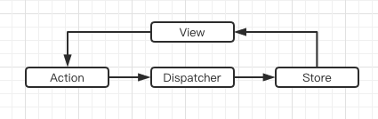
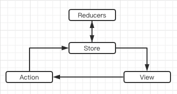
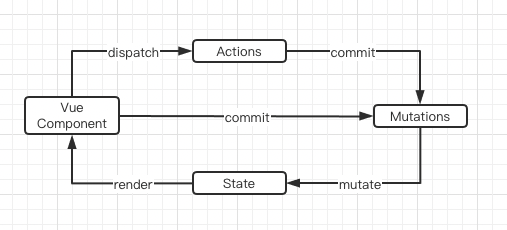

# 状态管理的那些事

不管是Vue，还是 React，都需要管理状态（state），比如组件之间都有共享状态的需要。什么是共享状态？比如一个组件需要使用另一个组件的状态，或者一个组件需要改变另一个组件的状态，都是共享状态。

父子组件之间，兄弟组件之间共享状态，往往需要写很多没有必要的代码，比如把状态提升到父组件里，或者给兄弟组件写一个父组件，听听就觉得挺啰嗦。

如果不对状态进行有效的管理，状态在什么时候，由于什么原因，如何变化就会不受控制，就很难跟踪和测试了。如果没有经历过这方面的困扰，可以简单理解为会搞得很乱就对了。

在软件开发里，有些通用的思想，比如隔离变化，约定优于配置等，隔离变化就是说做好抽象，把一些容易变化的地方找到共性，隔离出来，不要去影响其他的代码。约定优于配置就是很多东西我们不一定要写一大堆的配置，比如我们几个人约定，view 文件夹里只能放视图，不能放过滤器，过滤器必须放到 filter 文件夹里，那这就是一种约定，约定好之后，我们就不用写一大堆配置文件了，我们要找所有的视图，直接从 view 文件夹里找就行。

根据这些思想，对于状态管理的解决思路就是：把组件之间需要共享的状态抽取出来，遵循特定的约定，统一来管理，让状态的变化可以预测。

## Flux
Flux其实是一种思想，就像MVC，MVVM之类的，他给出了一些基本概念，所有的框架都可以根据他的思想来做一些实现。

Flux把一个应用分成了4个部分： View、Action、Dispatcher、Store



**Flux的最大特点就是数据都是单向流动的**

## Redux

Redux 里面只有一个 Store，整个应用的数据都在这个大 Store 里面。Store 的 State 不能直接修改，每次只能返回一个新的 State。Redux 整了一个 createStore 函数来生成 Store。



**createStore原理**
```js
const createStore = (reducer) => {
  let state;
  let listeners = [];

  const getState = () => state;

  const dispatch = (action) => {
    state = reducer(state, action);
    listeners.forEach(listener => listener());
  };

  const subscribe = (listener) => {
    listeners.push(listener);
    return () => {
      listeners = listeners.filter(l => l !== listener);
    }
  };

  dispatch({});

  return { getState, dispatch, subscribe };
};

const combineReducers = reducers => {
  return (state = {}, action) => {
    return Object.keys(reducers).reduce(
      (nextState, key) => {
        nextState[key] = reducers[key](state[key], action);
        return nextState;
      },
      {} 
    );
  };
};
```

Redux有三大原则： 
* 单一数据源：Flux 的数据源可以是多个。 
* State 是只读的：Flux 的 State 可以随便改。 
* 使用纯函数来执行修改：Flux 执行修改的不一定是纯函数。

Redux 和 Flux 一样都是单向数据流。

### Vuex

Vuex 主要用于 Vue，和 Flux，Redux 的思想很类似。



### Mobx

Flux 体系的状态管理方式，只是一个选项，但并不代表是唯一的选项。MobX 就是另一个选项。

MobX背后的哲学很简单：任何源自应用状态的东西都应该自动地获得。译成人话就是状态只要一变，其他用到状态的地方就都跟着自动变。

```js
const obj = observable({
    a: 1,
    b: 2
})

autoRun(() => {
    console.log(obj.a)
})

obj.b = 3 // 什么都没有发生
obj.a = 2 // observe 函数的回调触发了，控制台输出：2
```

上面的obj，他的 obj.a 属性被使用了，那么只要 obj.a 属性一变，所有使用的地方都会被调用。autoRun 就是这个老大哥，他看着所有依赖 obj.a 的地方，也就是收集所有对 obj.a 的依赖。当 obj.a 改变时，老大哥就会触发所有依赖去更新。

MobX 允许有多个 store，而且这些 store 里的 state 可以直接修改，不用像 Redux 那样每次还返回个新的。这个有点像 Vuex，自由度更高，写的代码更少。不过它也会让代码不好维护。

MobX 和 Flux、Redux 一样，都是和具体的前端框架无关的，也就是说可以用于 React（mobx-react) 或者 Vue（mobx-vue)。一般来说，用到 React 比较常见，很少用于 Vue，因为 Vuex 本身就类似 MobX，很灵活。如果我们把 MobX 用于 React 或者 Vue，可以看到很多 setState() 和 this.state.xxx = 这样的处理都可以省了。

比较一下：

Redux 数据流流动很自然，可以充分利用时间回溯的特征，增强业务的可预测性；MobX 没有那么自然的数据流动，也没有时间回溯的能力，但是 View 更新很精确，粒度控制很细。

Redux 通过引入一些中间件来处理副作用；MobX 没有中间件，副作用的处理比较自由，比如依靠 autorunAsync 之类的方法。

Redux 的样板代码更多，看起来就像是我们要做顿饭，需要先买个调料盒装调料，再买个架子放刀叉。。。做一大堆准备工作，然后才开始炒菜；而 MobX 基本没啥多余代码，直接硬来，拿着炊具调料就开干，搞出来为止。

但其实 Redux 和 MobX 并没有孰优孰劣，Redux 比 Mobx 更多的样板代码，是因为特定的设计约束。如果项目比较小的话，使用 MobX 会比较灵活，但是大型项目，像 MobX 这样没有约束，没有最佳实践的方式，会造成代码很难维护，各有利弊。一般来说，小项目建议 MobX 就够了，大项目还是用 Redux 比较合适。