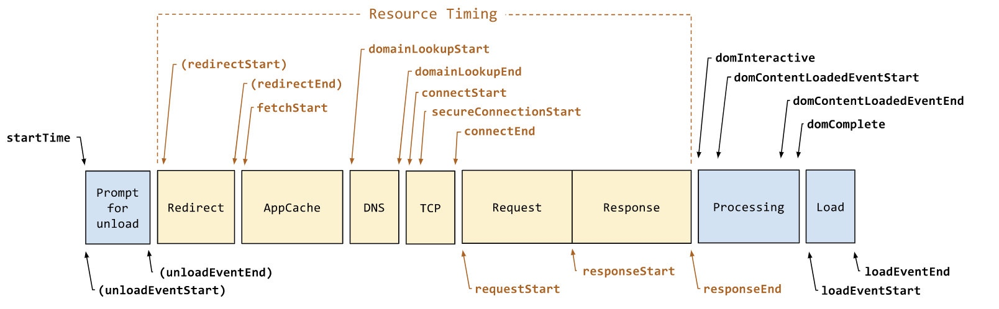

# 性能指标采集

## 收集 FP

```js
new PerformanceObserver((list) => {
  for (const entry of list.getEntries()) {
    console.log('FCP: ', entry.startTime);
  }
}).observe({
  type: 'first-contentful-paint',
  buffered: true,
});
```

## 收集FCP

```js
new PerformanceObserver((list) => {
  for (const entry of list.getEntries()) {
    console.log('FP: ', entry.startTime);
  }
}).observe({
  type: 'first-paint',
  buffered: true,
});
```

## 收集 LCP

```js
new PerformanceObserver(entryList => {
  for (const entry of entryList.getEntries()) {
    console.log('LCP: ', entry.startTime);
  }
}).observe({
    type: 'largest-contentful-paint',
    buffered: true
});
```

## 收集 FID

```js
new PerformanceObserver(list => {
  for (const entry of list.getEntries()) {
    // 开始处理 input 的时间 - input 操作的起始时间
    const FID = entry.processingStart - entry.startTime; 
    console.log('FID:', FID);
  }
}).observe({
  type: 'first-input',
  buffered: true,
});
```

## 收集 Load / DOMContentLoaded
```js
new PerformanceObserver(list => {
  for (const entry of list.getEntries()) {
    const Load = entry.loadEventStart - entry.fetchStart;
    console.log('Load:', Load);
  }
}).observe({
  type: 'navigation',
  buffered: true,

});

new PerformanceObserver(list => {
  for (const entry of list.getEntries()) {
    const DOMContentLoaded = entry.domContentLoadedEventStart - entry.fetchStart;
    console.log('DOMContentLoaded:', DOMContentLoaded);
  }
}).observe({
  type: 'navigation',
  buffered: true,
});

```

## Performance Timeline Level 2



### 获取渲染渲染性能指标
```js
// 获取性能指标
const getTiming = () => {
  const timing = window.performance.timing;
  return {
    // DNS解析时间
    dnst: timing.domainLookupEnd - timing.domainLookupStart || 0,
    //TCP建立时间
    tcpt: timing.connectEnd - timing.connectStart || 0,
    // 白屏时间
    writet: timing.responseStart - timing.navigationStart || 0,
    //dom渲染完成时间
    domt: timing.domContentLoadedEventEnd - timing.navigationStart || 0,
    //页面onload时间
    loadt: timing.loadEventEnd - timing.navigationStart || 0,
    // 页面准备时间
    readyt: timing.fetchStart - timing.navigationStart || 0,
    // 页面重定向时间
    redt: timing.redirectEnd - timing.redirectStart || 0,
    // unload时间
    unloadt: timing.unloadEventEnd - timing.unloadEventStart || 0,
    //request请求耗时
    reqt: timing.responseEnd - timing.requestStart || 0,
    //页面解析dom耗时
    andt: timing.domComplete - timing.domInteractive || 0,
  };
}
```
### 获取资源首屏资源加载时间
```js
const getEnteries = () => {
  const resources = window.performance.getEntriesByType('resource');
  const imageArrs = [],
        jsArrs = [],
        cssArrs = [],
        videoArrs = [],
        otherArrs = [];
  resources.map(item => {
    const d = {
      name: item.name,
      tcpTime: item.connectEnd - item.connectStart,
      duration: item.duration,
    };

    switch (checkResourceType(item.name)) {
      case 'image':
        imageArrs.push(d);
        break;
      case 'javascript':
        jsArrs.push(d);
        break;
      case 'css':
        cssArrs.push(d);
        break;
      case 'video':
        videoArrs.push(d);
        break;
      case 'others':
        otherArrs.push(d);
        break;
    }
  });
  return {
    js: jsArrs,
    css: cssArrs,
    image: imageArrs,
    video: videoArrs,
    others: otherArrs,
  };
}
```
