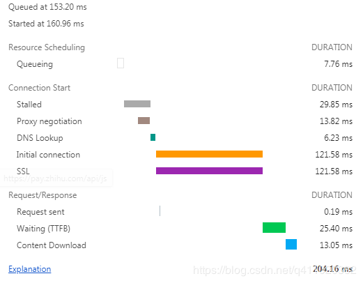

# 性能优化-网络

一个完整的 HTTP 请求需要经历 DNS 查找，TCP 握手，浏览器发出 HTTP 请求，服务器接收请求，服务器处理请求并发回响应，浏览器接收响应等过程。接下来看一个具体的例子帮助理解 HTTP ：



* Queueing: 在请求队列中的时间。
* Stalled: 从TCP 连接建立完成，到真正可以传输数据之间的时间差，此时间包括代理协商时间。
* Proxy negotiation: 与代理服务器连接进行协商所花费的时间。
* DNS Lookup: 执行DNS查找所花费的时间，页面上的每个不同的域都需要进行DNS查找。
* Initial Connection / Connecting: 建立连接所花费的时间，包括TCP握手/重试和协商SSL。
* SSL: 完成SSL握手所花费的时间。
* Request sent: 发出网络请求所花费的时间，通常为一毫秒的时间。
* Waiting(TFFB): TFFB 是发出页面请求到接收到应答数据第一个字节的时间。
* Content Download: 接收响应数据所花费的时间。

从这个例子可以看出，真正下载数据的时间占比为 13.05 / 204.16 = 6.39%，文件越小，这个比例越小，文件越大，比例就越高。这就是为什么要建议将多个小文件合并为一个大文件，从而减少 HTTP 请求次数的原因。

1. DNS缓存设置
```html
<link rel="dns-prefetch" href="//g.alicdn.com" />
```

希望在`HTTPS`页面开启自动解析功能时，添加如下标记：

```html
<meta http-equiv="x-dns-prefetch-control" content="on">
```

2. 浏览器有TCP链接数量限制，将资源请求域名控制在6个以内

3. 使用CDN作为静态资源地址，加快响应速度

4. 资源压缩处理，减少网络传输包的大小（webpack压缩）

5. 开启服务端压缩GZIP

6. 小资源进行合并处理

7. 代码合理分包处理

8. 服务端渲染（不需要等待页面资源响应）

9. 静态化处理部分网页

10. 使用Http2（多路复用、首部压缩）

11. 缓存设置（强缓存和协商缓存）


