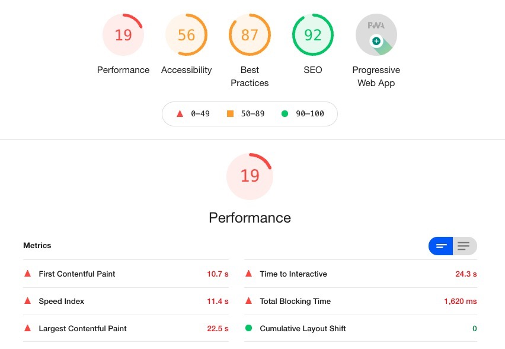
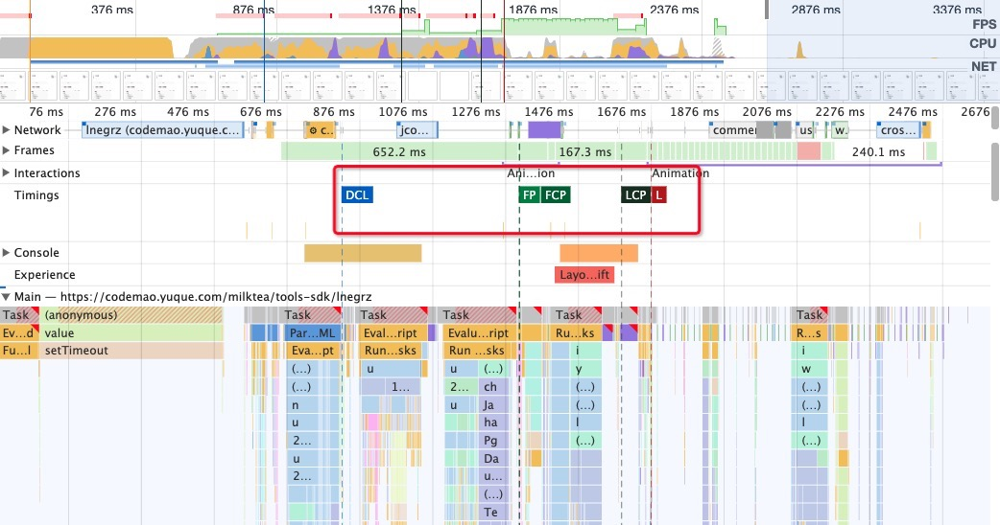

# 性能指标

*页面在 Lighthouse 下跑出来的性能数据*

### First Paint(FP) 首次绘制

首次渲染的时间点，可以视为白屏时间，比如完成背景色渲染的时间点。通常作为时间点最早的一个性能指标。

### First Contentful Paint(FCP) 首次内容绘制

首次有内容渲染的时间点，指标测量页面从开始加载到页面内容的任何部分在屏幕上完成渲染的时间。对于该指标，"内容"指的是文本、图像、`<svg>`元素或非白色的`<canvas>`元素。可以作为首屏时间。

> FP vs FCP
>
> FP：从开始加载到第一次渲染
>
> FCP：从开始加载到第一次内容渲染。
>
> FCP 是 FP 的增强版，对用户来说更关键。因为 FCP 带着图像和文字这些内容信息，是用户更关心的。
>
> FP 和 FCP 可能是重合的。

### Largest Contentful Paint (LCP) 最大内容绘制

页面的最大内容（通常是比较核心的内容）加载完成的时间，这个最大内容可以是图片/文本块。它是一个 SEO 相关的指标。

> LCP vs FCP
>
> FCP：页面加载过程中，比较早期的一个指标，如果一个页面有 loading 态，这个指标表现可能很好，但是实际内容什么时候呈现给用户，这个指标没办法衡量。
>
> LCP：关注页面核心内容呈现时间，这个内容是用户更感兴趣的，更加用户相关。

### First Meaningful Paint(FMP) 首次有效绘制

首次绘制有意义内容的时间。业界比较认可的方式是在加载和渲染过程中最大布局变动之后的那个绘制时间即为当前页面的 FMP。因为它计算相对复杂，且存在准确性等问题，Lighthouse 6.0 中被废弃。

> LCP vs FMP
>
> FMP: 早期比较推荐的性能指标，但是计算更复杂，而且准确性不是很好
>
> LCP: 更新的数据指标，有 API 直接支持，统计简单，且准确，但也存在最大内容是否为最核心内容这样的问题。

### First Input Delay(FID) 首次输入延迟

这个指标的触发是在用户第一次与页面交互的的时候，记录的是是用户第一次与页面交互到浏览器真正能够开始处理事件处理程序以响应该交互的时间，即交互延迟时间。比如发生在用户第一次在页面进行 click， keydown 等交互。

为什么会有这样的延迟呢？一般来说，发生输入延迟是因为浏览器的主线程正忙着执行其他工作（比如解析和执行大型 JS 文件），还不能响应用户

### Cumulative Layout Shift(CLS) 累积布局偏移

在一个页面的生命周期中，会不断的发生布局变化（layout shift），对每一次布局变化做一个累积的记分，其中得分最大布局变化即为 CLS。是衡量页面稳定性的重要指标（visual stability）

### Time to Interactive(TTI) 可交互时间

> Long Task：如果浏览器主线程执行的一个 task 耗时大于 50ms，那么这个 task 称为 long task。用户的交互操作也是在主线程执行的，所以当发生 Long Task 时，用户的交互操作很可能无法及时执行，这时用户就会体验到卡顿（当页面响应时间超过 100ms 时，用户可以体验到卡顿），进而影响用户体验。

### DOMContentLoaded(DCL)

DOM 加载完成即触发，不用等页面资源加载。

### Load(L)

页面及其依赖的资源全部加载完成的时间，包括所有的资源文件，如样式表和图片等。

