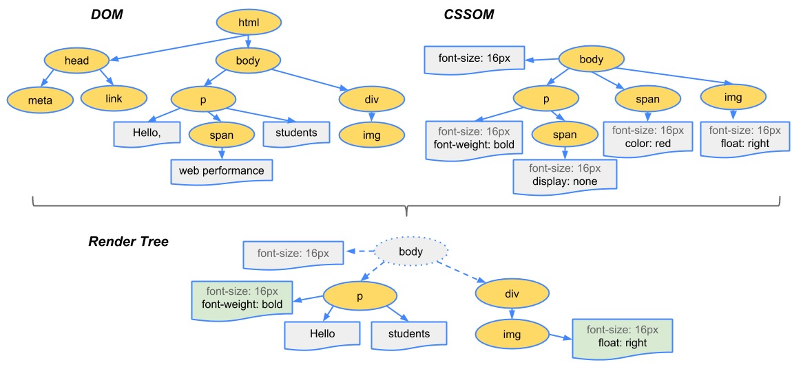

# 回流与重绘

### 浏览器的渲染过程

浏览器渲染过程如下：

1. 解析HTML，生成DOM树，解析CSS，生成CSSOM树
2. 将DOM树和CSSOM树结合，生成渲染树(Render Tree)
3. Layout(回流):根据生成的渲染树，进行回流(Layout)，得到节点的几何信息（位置，大小）
4. Painting(重绘):根据渲染树以及回流得到的几何信息，得到节点的绝对像素
5. Display:将像素发送给GPU，展示在页面上。

### 回流

通过构造渲染树，将可见DOM节点以及它对应的样式结合起来，可是还需要**计算它们在设备视口(viewport)内的确切位置和大小**，这个计算的阶段就是回流。

### 重绘

通过构造渲染树和回流阶段，知道了哪些节点是可见的，以及可见节点的样式和具体的几何信息(位置、大小)，那么就可以**将渲染树的每个节点都转换为屏幕上的实际像素**，这个阶段就叫做重绘节点。

### 何时发生回流重绘

- 添加或删除可见的DOM元素
- 元素的位置发生变化
- 元素的尺寸发生变化（包括外边距、内边框、边框大小、高度和宽度等）
- 内容发生变化，比如文本变化或图片被另一个不同尺寸的图片所替代。
- 页面一开始渲染的时候（这肯定避免不了）
- 浏览器的窗口尺寸变化（因为回流是根据视口的大小来计算元素的位置和大小的）

**回流一定会触发重绘，而重绘不一定会回流**

### 浏览器的优化机制

现代的浏览器都是很聪明的，由于每次重排都会造成额外的计算消耗，因此大多数浏览器都会通过队列化修改并批量执行来优化重排过程。浏览器会将修改操作放入到队列里，直到过了一段时间或者操作达到了一个阈值，才清空队列。**获取布局信息的操作的时候，会强制队列刷新**，比如当你访问以下属性或者使用以下方法：

- offsetTop、offsetLeft、offsetWidth、offsetHeight
- scrollTop、scrollLeft、scrollWidth、scrollHeight
- clientTop、clientLeft、clientWidth、clientHeight
- getComputedStyle()
- getBoundingClientRect
- elem.focus()、elem.focus.select()
- mouseEvt.layerX、 mouseEvt.layerY、mouseEvt.offsetX、mouseEvt.offsetY 

如果要使用它们，最好将值缓存起来。

### 减少回流和重绘

1. 批量处理样式
2. 批量修改Dom
3. 多使用Css3
4. 复杂的动画可以是其容器脱离文档流
5. 对于一些计算属性，尽量先缓存起来，再使用