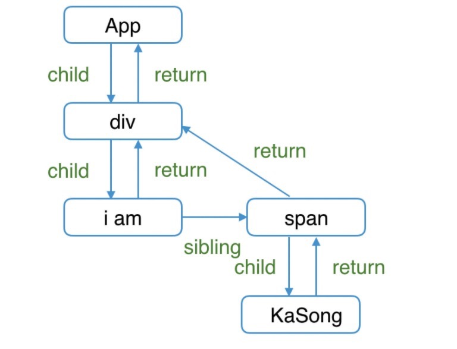
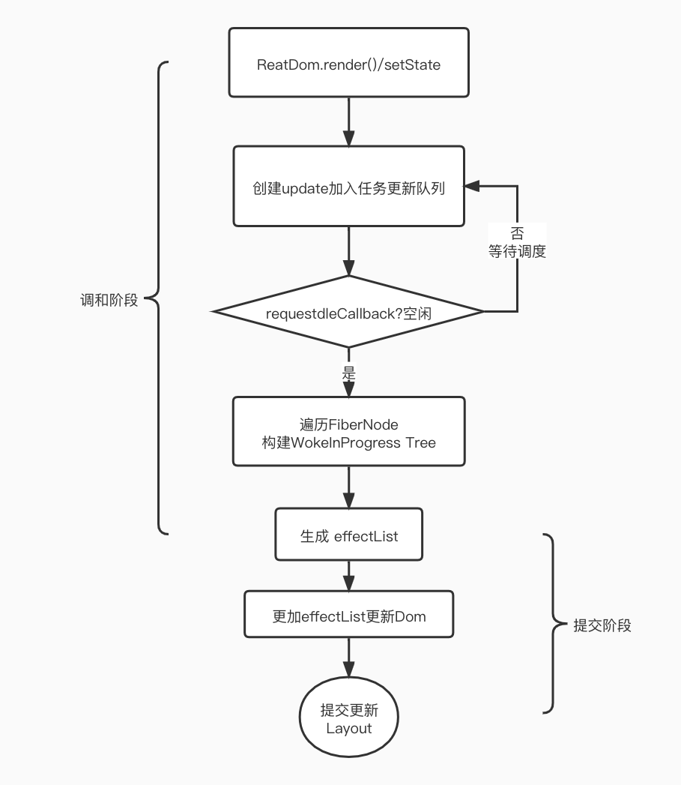

# React Fiber

### 一、Fiber前世今生

**Fiber前世**

> React 15 架构主要有：Reconciler（diff算法，找出变化的组件）、Renderer（负责将变化的组件更新到页面上）。
>
> 在**Reconciler**中，`mount`的组件会调用[mountComponent ](https://github.com/facebook/react/blob/15-stable/src/renderers/dom/shared/ReactDOMComponent.js#L498)，`update`的组件会调用[updateComponent ](https://github.com/facebook/react/blob/15-stable/src/renderers/dom/shared/ReactDOMComponent.js#L877)。这两个方法都会递归更新子组件。
>
> 由于递归执行，所以更新一旦开始，中途将无法中断，递归更新时间超过16ms,用户交互卡顿。

**Fiber今生**

> React 16架构主要有：Scheduler（调度任务的优先级，高优任务优先进入Reconciler）、Reconciler（负责找出变化的组件）、Renderer（负责将变化的组件渲染到页面上）。
>
> Scheduler: 类似于`window.requestIdleCallback()`方法插入一个函数，这个函数将在浏览器空闲时期被调用。这使开发者能够在主事件循环上执行后台和低优先级工作，而不会影响延迟关键事件，如动画和输入响应。函数一般会按先进先调用的顺序执行，然而，如果回调函数指定了执行超时时间`timeout`，则有可能为了在超时前执行函数而打乱执行顺序。
>
> Reconciler：将React15递归不可中断的架构变成中断可循环的过程，当Scheduler将任务交给Reconciler后，Reconciler会为变化的虚拟DOM打上代表增/删/更新的标记。
>
> Reconciler： 同步更新Reconciler产生变化的组件。

总结：

React Fiber是充分利用浏览器的工作机制，将同步更新任务，切割成多个任务，实现可中断更新的能力和为不同类型的更新分配优先级的能力。

### 二、Fiber的设计思路

#### 1. Fiber调度单元：Fiber Node

```js
{
  ...
  // 跟当前Fiber相关本地状态（比如浏览器环境就是DOM节点）
  stateNode: any,
    
    // 单链表树结构
  return: Fiber | null,// 指向他在Fiber节点树中的`parent`，用来在处理完这个节点之后向上返回
  child: Fiber | null,// 指向自己的第一个子节点
  sibling: Fiber | null,  // 指向自己的兄弟结构，兄弟节点的return指向同一个父节点

  // 更新相关
  pendingProps: any,  // 新的变动带来的新的props
  memoizedProps: any,  // 上一次渲染完成之后的props
  updateQueue: UpdateQueue<any> | null,  // 该Fiber对应的组件产生的Update会存放在这个队列里面
  memoizedState: any, // 上一次渲染的时候的state
    
  // Scheduler 相关
  expirationTime: ExpirationTime,  // 代表任务在未来的哪个时间点应该被完成，不包括他的子树产生的任务
  // 快速确定子树中是否有不在等待的变化
  childExpirationTime: ExpirationTime,
    
 // 在Fiber树更新的过程中，每个Fiber都会有一个跟其对应的Fiber
  // 我们称他为`current <==> workInProgress`
  // 在渲染完成之后他们会交换位置
  alternate: Fiber | null,

  // Effect 相关的
  effectTag: SideEffectTag, // 用来记录Side Effect
  nextEffect: Fiber | null, // 单链表用来快速查找下一个side effect
  firstEffect: Fiber | null,  // 子树中第一个side effect
  lastEffect: Fiber | null, // 子树中最后一个side effect
  ....
};
```

App对应的Fiber链表关系图

```js
function App() {
  return (
    <div>
      i am
      <span>KaSong</span>
    </div>
  )
}
```


#### 2. Fiber调度优先级

> 每个 Fiber Node 都会有一个 ExpirationTime 到期时间来确定当前时间片下是否执行该节点的更新任务。
>
> 它是以任务什么时候该执行完为描述信息的，到期时间越短，则代表优先级越高。

#### 3. Fiber 双缓存机制

> 双缓冲具体指的是 workInProgress tree 构造完毕，得到的就是新的 fiber tree ，每个 fiber 上都有个 alternate 属性，也指向一个 fiber ，创建 workInProgress 节点时优先取 alternate ，没有的话就创建一个。
>
> fiber 与 workInProgress 互相持有引用，把 current 指针指向 workInProgress tree ，丢掉旧的 fiber tree 。旧 fiber 就作为新 fiber 更新的预留空间，达到复用 fiber 实例的目的。

#### 4. Fiber 触发更新发生了什么

> 首先, 当前是哪个组件触发的更新, React 是知道的( this 指向), 于是 React 会针对**当前组件**计算其相应的到期时间(上面提到了[计算方法](https://link.zhihu.com/?target=https%3A//km.sankuai.com/page/156013163%23id-%E8%A7%84%E5%AE%9A%E8%B0%83%E5%BA%A6%E9%A1%BA%E5%BA%8F---expirationTime%E5%88%B0%E6%9C%9F%E6%97%B6%E9%97%B4)), 并且基于这个到期时间, 创建一个**更新 update ,** 将引起改变的 payload (比如说 state/props ), 作为此次更新的一个属性, 并插入当前组件对应的 Fiber Node 的更新队列（它是一个单向链表数据结构。只要有 setState 或者其他方式触发了更新，就会在 fiber 上的 updateQueue 里插入一个 update，这样在更新的时候就可以合并一起更新。）中, 之后开始调度任务。
>
> 整个调度的过程是计算并重新构建 workInProgress Tree 的过程，在 workInProgress Tree 和原有 Fiber Tree 对比的时候记录下 Diff，标记对应的 Effect， 完成之后会生成一个 Effect List，这个 Effect List 就是最终 Commit 阶段用来处理副作用的阶段， 如果在这个过程中有了交互事件等高优先级的任务进来，那么 fiber 会终止当前任务， 执行更紧急的任务， 但为了避免 “饥饿现象”， 上一个吊起的任务的优先级会被相应的提升。

#### 5.effetList

> 每一个 Fiber Node 都有与之相关的 effect ， effect 是用于记录由于 state 和 props 改变引起的工作类型， 对于不同类型的 Fiber Node 有不同的改变类型，比如对 DOM 元素，工作包括添加，更新或删除元素。对于 class 组件，React 可能需要更新 ref 并调用 componentDidMount 和 componentDidUpdate 生命周期方法。
>
> 每个 Fiber Node 都有个 nextEffect 用来快速查找下一个改变 effect，他使得更新的修改能够快速遍历整颗树，跳过没有更改的 Fiber Node。

### 三、 Fiber 执行过程


