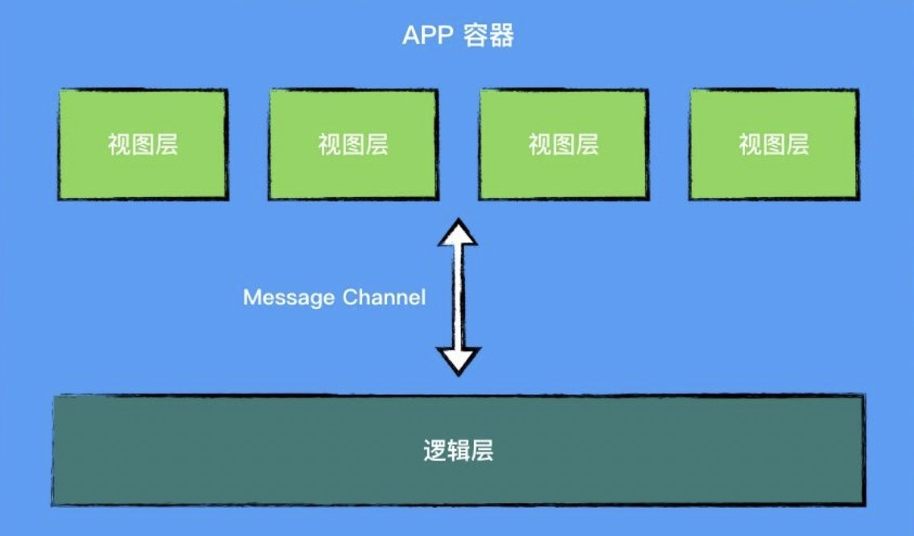
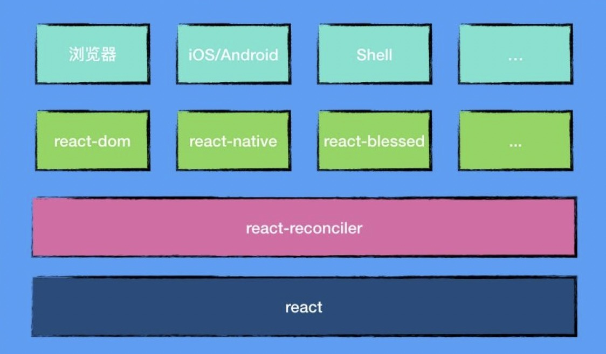

# Remax 实现原理

### 一、从小程序架构到React架构

Remax 是一个使用React开发小程序的框架，可以理解为面向小程序的React Native。

**小程序架构图**



小程序架构分为两层，你写的逻辑代码独立运行在一个进程中，每个页面会有自己独立的渲染进程（也就是一个 webview）用来渲染模板。而整个小程序又运行在 APP 容器中（也就是支付宝和微信本身）。逻辑层和视图层之间通过建立一个消息通道来通信。

**React架构图**



React由Renderer、ReactReconciler组成。上层的 ReactDOM 和 ReactNative 为Renderer，Renderer 跟 React 之间通过 ReactReconciler 连接把元素（虚拟 DOM）渲染到对应的平台上。

Remax就是基于React架构，实现了一个基于小程序平台的Renderer。

### 二、了解Renderer

#### 1. 自定义HostConfig

```js
const Reconciler = require('react-reconciler');

const HostConfig = {
  // ... 实现适配器方法和配置项
};
```

#### 2. 实现ReactDom.render

```js
// 创建Reconciler实例, 并将HostConfig传递给Reconciler
const MyRenderer = Reconciler(HostConfig);

/**
 * 假设和ReactDOM一样，接收三个参数
 * render(<MyComponent />, container, () => console.log('rendered'))
 */
export function render(element, container, callback) {
  // 创建根容器
  if (!container._rootContainer) {
    container._rootContainer = ReactReconcilerInst.createContainer(container, false);
  }

  // 更新根容器
  return ReactReconcilerInst.updateContainer(element, container._rootContainer, null, callback);
}
```

HostConfig内的方法执行时机

```text
| 协调阶段                 | 开始提交         | 提交阶段                  | 提交完成         |
|-------------------------|----------------|--------------------------|-----------------|
| createInstance          | prepareCommit  | appendChild              | resetAfterCommit|
| createTextInstance      |                | appendChildToContainer   | commitMount     |
| shouldSetTextContent    |                | insertBefore             |                 |
| appendInitialChild      |                | insertInContainerBefore  |                 |
| finalizeInitialChildren |                | removeChild              |                 |
| prepareUpdate           |                | removeChildFromContainer |                 |
|                         |                | commitTextUpdate         |                 |
|                         |                | commitUpdate             |                 |
|                         |                | resetTextContent         |                 |
```

代码仓库：https://github.com/luoguoxiong/react-custom-render

### 三、渲染

Remax渲染器代码仓库:https://github.com/remaxjs/remax/tree/master/packages/remax-runtime

React 组件最终会被渲染成一个我们称之为 `VNode` 的 JSON 对象，并且这个对象会作为小程序 `Page` 的 `data`。

```xml
<block a:for="{{root.children}}" a:key="{{item.id}}">
  <template is="{{'REMAX_TPL_' + item.type}}" data="{{item: item}}" />
</block>

<template name="REMAX_TPL_view">
  <view class="{{item.props['className']}}">
    <block a:for="{{item.children}}" key="{{item.id}}">
      <template is="{{'REMAX_TPL_' + item.type}}" data="{{item: item}}" />
    </block>
  </view>
</template>

<template name="REMAX_TPL_text">
  <text>
    <block a:for="{{item.children}}" key="{{item.id}}">
      <template is="{{'REMAX_TPL_' + item.type}}" data="{{item: item}}" />
    </block>
  </text>
</template>

<template name="REMAX_TPL_plain-text">
  <block>{{item.text}}</block>
</template>

```

### 四、总结

1. react和web是无关的，react-dom和web是有关的，但是react有reconcilers，remax通过remax自己实现的reconcilers把react运行在小程序上，react还是参与了渲染，react负责生成VNode，VNode再通过template渲染。
2. 小程序没有暴露基础的dom api，要更新视图，只有setData一条路，需要将react的更新又构造为setData需要的数据结构，如果需要setData大量数据，性能存在隐患。