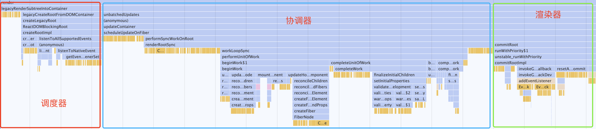

# 源码分析-调试篇

### 一、拉去React 仓库代码
```shell
    git clone git@github.com:facebook/react.git
```

### 二、安装依赖并构建和创建软连
```shell
cd react

yarn

yarn build react/index,react/jsx,react-dom/index,scheduler --type=NODE

cd build/node_modules/react
# 申明react指向
yarn link
cd build/node_modules/react-dom
# 申明react-dom指向
yarn link
```

### 三、使用create-react-app 创建调试项目
```shell
npx create-react-app react-code

yarn link react react-dom
```
### 四、打开调试工具Performance面板

