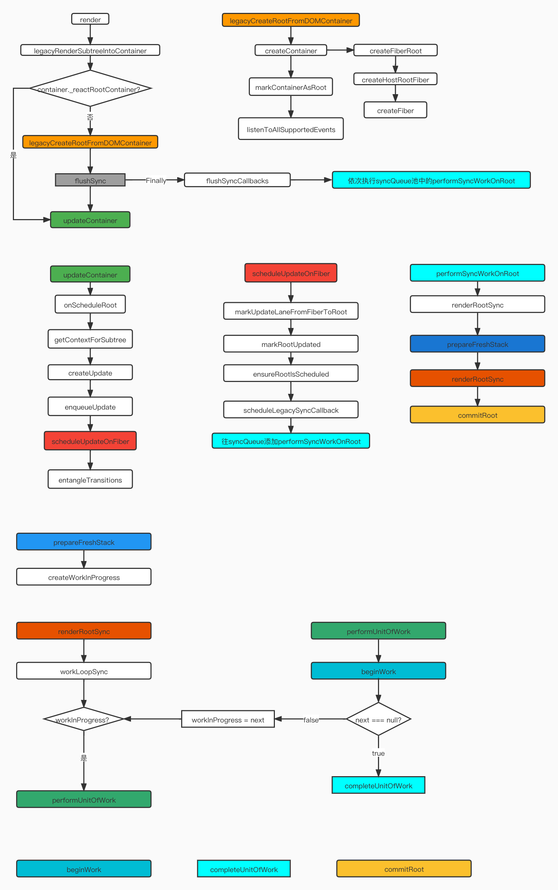

# 源码分析-React.render

### 一、 React.render 函数调用栈概览图
```js
import React from 'react';
import ReactDOM from 'react-dom';

function App() {
  return (
    <div className="App">
      <header className="App-header">
          Learn React
      </header>
    </div>
  );
}

ReactDOM.render(
    <App />,
  document.getElementById('root')
);
```



### 二、函数分析

#### 1. legacyRenderSubtreeIntoContainer

> 1. 通过legacyCreateRootFromDOMContainer构建FiberRoot
> 2. flushSync执行updateContainer进行调度和调和

```js
function legacyRenderSubtreeIntoContainer(
  parentComponent: ?React$Component<any, any>,
  children: ReactNodeList,
  container: Container,
  forceHydrate: boolean,
  callback: ?Function,
) {
  let root = container._reactRootContainer;
  let fiberRoot: FiberRoot;
  if (!root) {
    // Initial mount
    root = container._reactRootContainer = legacyCreateRootFromDOMContainer(
      container,
      forceHydrate,
    );
    fiberRoot = root;
    //---callback函数处理省略
    // Initial mount should not be batched.
    flushSync(() => {
      updateContainer(children, fiberRoot, parentComponent, callback);
    });
  } else {
    fiberRoot = root;
   //---callback函数处理省略
    // Update
    updateContainer(children, fiberRoot, parentComponent, callback);
  }
  return getPublicRootInstance(fiberRoot);
}
```

#### 2. legacyCreateRootFromDOMContainer

> 1. 非服务端渲染清除根节点里面的dom树
> 2. 创建根Fiber节点
> 3. 注册React事件机制（listenToAllSupportedEvents）

```js
function legacyCreateRootFromDOMContainer(
  container: Container,
  forceHydrate: boolean,
): FiberRoot {
  // 清除根节点里面的dom树
  if (!forceHydrate) {
    let rootSibling;
    while ((rootSibling = container.lastChild)) {
      container.removeChild(rootSibling);
    }
  }

  const root = createContainer(
    container,
    LegacyRoot,
    forceHydrate,
    null, // hydrationCallbacks
    false, // isStrictMode
    false, // concurrentUpdatesByDefaultOverride,
  );
  markContainerAsRoot(root.current, container);

  const rootContainerElement =
    container.nodeType === COMMENT_NODE ? container.parentNode : container;
  // React 事件机制入口
  listenToAllSupportedEvents(rootContainerElement);

  return root;
}
```

#### 3. createFiberRoot

> 创建并初始化FiberRoot的属性

```js
export function createFiberRoot(
  containerInfo: any,
  tag: RootTag,
  hydrate: boolean,
  hydrationCallbacks: null | SuspenseHydrationCallbacks,
  isStrictMode: boolean,
  concurrentUpdatesByDefaultOverride: null | boolean,
): FiberRoot {
  const root: FiberRoot = (new FiberRootNode(containerInfo, tag, hydrate): any);
  // 创建根节点
  const uninitializedFiber = createHostRootFiber(
    tag,
    isStrictMode,
    concurrentUpdatesByDefaultOverride,
  );
  root.current = uninitializedFiber;
  uninitializedFiber.stateNode = root;
  if (enableCache) {
    const initialCache = createCache();
    retainCache(initialCache);
    root.pooledCache = initialCache;
    retainCache(initialCache);
    const initialState = {
      element: null,
      cache: initialCache,
    };
    uninitializedFiber.memoizedState = initialState;
  } else {
    const initialState = {
      element: null,
    };
    uninitializedFiber.memoizedState = initialState;
  }
  initializeUpdateQueue(uninitializedFiber);
  return root;
}
```

#### 4. updateContainer

```js
function updateContainer(
  element: ReactNodeList,
  container: OpaqueRoot,
  parentComponent: ?React$Component<any, any>,
  callback: ?Function,
): Lane {
   // 优先级相关
  const current = container.current;
  const eventTime = requestEventTime();
  const lane = requestUpdateLane(current);

   // 获取子节点的context
  const context = getContextForSubtree(parentComponent);
  if (container.context === null) {
    container.context = context;
  } else {
    container.pendingContext = context;
  }

   // 创建update
  const update = createUpdate(eventTime, lane);
    
  update.payload = {element};

  callback = callback === undefined ? null : callback;
  if (callback !== null) {
    update.callback = callback;
  }

  enqueueUpdate(current, update, lane);
    
  // 从FiberRoot开始调度
  const root = scheduleUpdateOnFiber(current, lane, eventTime);
  if (root !== null) {
    entangleTransitions(root, current, lane);
  }

  return lane;
}
```

#### 5. scheduleUpdateOnFiber

```js
export function scheduleUpdateOnFiber(
  fiber: Fiber,
  lane: Lane,
  eventTime: number,
): FiberRoot | null {
		// ===========  
    ensureRootIsScheduled(root, eventTime);
   //  ===
  return root;
}
```

#### 6. ensureRootIsScheduled

> 调度器入口,处理Fiber的调度方式初始（参考官方注释）
>
> // Use this function to schedule a task for a root. There's only one task per
>
> // root; if a task was already scheduled, we'll check to make sure the priority
>
> // of the existing task is the same as the priority of the next level that the
>
> // root has work on. This function is called on every update, and right before
>
> // exiting a task.

#### 7. performSyncWorkOnRoot

> 1. 执行renderRootSync开始本次Fiber树的构建
> 2. renderRootSync调度完，执行commitRoot完成本次渲染流程。

```js
function performSyncWorkOnRoot(root) {
  let exitStatus = renderRootSync(root, lanes);
 
  const finishedWork: Fiber = (root.current.alternate: any);
  root.finishedWork = finishedWork;
  root.finishedLanes = lanes;
  commitRoot(root);

  ensureRootIsScheduled(root, now());

  return null;
}
```

#### 8.renderRootSync

> 1. 调度异场处理
> 2. prepareFreshStack生成workInProgress
> 3. workLoopSync 执行当前任务
> 4. 状态重置工作

```js
function renderRootSync(root: FiberRoot, lanes: Lanes) {
  if (workInProgressRoot !== root || workInProgressRootRenderLanes !== lanes) {
    prepareFreshStack(root, lanes);
  }
  do {
    try {
      workLoopSync();
      break;
    } catch (thrownValue) {
      handleError(root, thrownValue);
    }
  } while (true);
  
  workInProgressRoot = null;
  workInProgressRootRenderLanes = NoLanes;

  return workInProgressRootExitStatus;
}
```

#### 9. workLoopSync

```js
function workLoopSync() {
  while (workInProgress !== null) {
    performUnitOfWork(workInProgress);
  }
}
```

#### 10. performUnitOfWork

> 结合workLoopSync的判断，深度优先遍历构建完整的Fiber树

```js
function performUnitOfWork(unitOfWork: Fiber): void {
  // The current, flushed, state of this fiber is the alternate. Ideally
  // nothing should rely on this, but relying on it here means that we don't
  // need an additional field on the work in progress.
  const current = unitOfWork.alternate;
  setCurrentDebugFiberInDEV(unitOfWork);

  let next;
  if (enableProfilerTimer && (unitOfWork.mode & ProfileMode) !== NoMode) {
    startProfilerTimer(unitOfWork);
    next = beginWork(current, unitOfWork, subtreeRenderLanes);
    stopProfilerTimerIfRunningAndRecordDelta(unitOfWork, true);
  } else {
    next = beginWork(current, unitOfWork, subtreeRenderLanes);
  }

  resetCurrentDebugFiberInDEV();
  unitOfWork.memoizedProps = unitOfWork.pendingProps;
  if (next === null) {
    // If this doesn't spawn new work, complete the current work.
    completeUnitOfWork(unitOfWork);
  } else {
    workInProgress = next;
  }

  ReactCurrentOwner.current = null;
}
```

