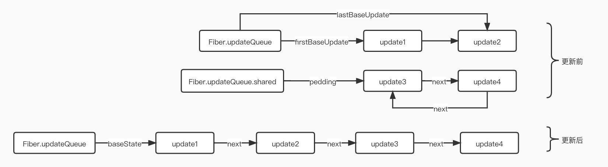

# 源码分析-Fiber 树的构建

### 一、Fiber 树概览图

```js
import React from 'react';
import ReactDOM from 'react-dom';

function App() {
    return (
        <div className="App">
            <header className="App-header">Learn React</header>
            <footer>footer</footer>
        </div>
    );
}

ReactDOM.render(<App />, document.getElementById('root'));
```

在 worKLoopSync 执行完，会生成一个如图下的 Fiber 树的结构数据


### 二、mount 阶段 Fiber 树构建流程

> 1. fiber 树的构建主要由 beginWork 和 completeUnitOfWork 两个函数执行构成。
> 2. beginWork 执行思路是深度遍历。从 FiberRoot 不断向下返回子 Fiber，子 Fiber 会赋值给 workingProgress,如果没有子 Fiber,则 workingProgress 赋值为 null 后，就进入了 completeUnitOfWork 逻辑
> 3. completeUnitOfWork 执行思路是深度优先执行 fiber 的 completeWork 工作。执行完 completeWork，当前 fiber 节点有 sibling 兄弟节点，则赋值给 workingProgress，兄弟节点继续执行 beginWork 流程，如果没有兄弟节点，则 fiber 的 return 父节点进入 completeWork 流程。
> 4. fiber 树的构建就是深度优先遍历的结果。


### 1. mount 阶段 beginWork 过程

> beginwork的工作就是创建子fiber节点
>
> current就是workInProgress的alternate属性。跟fiber双缓存机制有关，主要用于复用前节点，达到优化fiberNode创建过程。
>
> 首屏渲染current值是存在的，可以在createFiberRoot有体现。

```js
function beginWork(
  current: Fiber | null,
  workInProgress: Fiber,
  renderLanes: Lanes,
): Fiber | null {
  if (current !== null) {
    const oldProps = current.memoizedProps;
    const newProps = workInProgress.pendingProps;
    // 判断props、context是否有变化，走优化逻辑
    if (oldProps !== newProps || hasLegacyContextChanged()) {
      didReceiveUpdate = true;
    } else {
      // ========省略
    }
  } else {
    didReceiveUpdate = false;
  }
  workInProgress.lanes = NoLanes;
  switch (workInProgress.tag) {
    case IndeterminateComponent:
    case LazyComponent:
    // ========省略
    }
  }
}
```

#### 2. updateHostRoot

> updateHostRoot处理根Fiber节点的相关逻辑,mount阶段即处理FiberRoot的节点的update。

```js
function updateHostRoot(current, workInProgress, renderLanes) {
  const updateQueue = workInProgress.updateQueue;
  const nextProps = workInProgress.pendingProps;
  const prevState = workInProgress.memoizedState;
  const prevChildren = prevState.element;
  // 从current复制updateQuee到workInProgress
  cloneUpdateQueue(current, workInProgress);
  // 处理fiber的updateQueue
  processUpdateQueue(workInProgress, nextProps, null, renderLanes);
  const nextState = workInProgress.memoizedState;
  const root: FiberRoot = workInProgress.stateNode;

  const nextChildren = nextState.element;
  if (nextChildren === prevChildren) {
    return bailoutOnAlreadyFinishedWork(current, workInProgress, renderLanes);
  }
  // 省略了部分代码、、、、、
  reconcileChildren(current, workInProgress, nextChildren, renderLanes);
  resetHydrationState();
  return workInProgress.child;
}
```

#### 3. processUpdateQueue

> 该函数主要处理fiber的updateQueue，设计比较复杂的链表操作,先了解下Update与Fiber.updateQueue。

#### 1. Update

> `ClassComponent`与`HostRoot`（即`rootFiber.tag`对应类型）共用同一种`Update结构

```js
const update: Update<*> = {
  eventTime,
  lane,
  suspenseConfig,
  tag: UpdateState,
  payload: null,
  callback: null,
  next: null,
};
```

> - eventTime：任务时间，通过`performance.now()`获取的毫秒数。由于该字段在未来会重构，当前我们不需要理解他。
> - lane：优先级相关字段。当前还不需要掌握他，只需要知道不同`Update`优先级可能是不同的。
> - uspenseConfig：`Suspense`相关，暂不关注。
>
> - tag：更新的类型，包括`UpdateState` | `ReplaceState` | `ForceUpdate` | `CaptureUpdate`。
> - payload：更新挂载的数据，不同类型组件挂载的数据不同。对于`ClassComponent`，`payload`为`this.setState`的第一个传参。对于`HostRoot`，`payload`为`ReactDOM.render`的第一个传参。
> - callback：更新的回调函数。
> - next：与其他`Update`连接形成链表。

#### 2.  Update与Fiber的联系

> `Fiber节点`最多同时存在两个`updateQueue`：
>
> - `current fiber`保存的`updateQueue`即`current updateQueue`
> - `workInProgress fiber`保存的`updateQueue`即`workInProgress updateQueue`
>
> 在`commit阶段`完成页面渲染后，`workInProgress Fiber树`变为`current Fiber树`，`workInProgress Fiber树`内`Fiber节点`的`updateQueue`就变成`current updateQueue`。

```js
const queue: UpdateQueue<State> = {
    baseState: any,
    firstBaseUpdate: null,
    lastBaseUpdate: null,
    shared: {
      pending: null,
    },
    effects: null,
  };
```

> - baseState：本次更新前该`Fiber节点`的`state`，`Update`基于该`state`计算更新后的`state`。
>
> - `firstBaseUpdate`与`lastBaseUpdate`：本次更新前该`Fiber节点`已保存的`Update`。以链表形式存在，链表头为`firstBaseUpdate`，链表尾为`lastBaseUpdate`。之所以在更新产生前该`Fiber节点`内就存在`Update`，是由于某些`Update`优先级较低所以在上次`render阶段`由`Update`计算`state`时被跳过。
>
> - `shared.pending`：触发更新时，产生的`Update`会保存在`shared.pending`中形成单向环状链表。当由`Update`计算`state`时这个环会被剪开并连接在`lastBaseUpdate`后面。
>
> - effects：数组。保存`update.callback !== null`的`Update`。

#### 3. 更新前后对比



```js
//ReactUpdateQueue.old.js
export function processUpdateQueue<State>(
  workInProgress: Fiber,
  props: any,
  instance: any,
  renderLanes: Lanes,
): void {
  const queue: UpdateQueue<State> = (workInProgress.updateQueue: any);
  hasForceUpdate = false;

  let firstBaseUpdate = queue.firstBaseUpdate;//updateQueue的第一个Update
  let lastBaseUpdate = queue.lastBaseUpdate;//updateQueue的最后一个Update
  let pendingQueue = queue.shared.pending;//未计算的pendingQueue

  if (pendingQueue !== null) {
    queue.shared.pending = null;
    const lastPendingUpdate = pendingQueue;//未计算的ppendingQueue的最后一个update
    const firstPendingUpdate = lastPendingUpdate.next;//未计算的pendingQueue的第一个update
    lastPendingUpdate.next = null;//剪开环状链表
    if (lastBaseUpdate === null) {//将pendingQueue加入到updateQueue
      firstBaseUpdate = firstPendingUpdate;
    } else {
      lastBaseUpdate.next = firstPendingUpdate;
    }
    lastBaseUpdate = lastPendingUpdate;

    const current = workInProgress.alternate;//current上做同样的操作
    if (current !== null) {
      const currentQueue: UpdateQueue<State> = (current.updateQueue: any);
      const currentLastBaseUpdate = currentQueue.lastBaseUpdate;
      if (currentLastBaseUpdate !== lastBaseUpdate) {
        if (currentLastBaseUpdate === null) {
          currentQueue.firstBaseUpdate = firstPendingUpdate;
        } else {
          currentLastBaseUpdate.next = firstPendingUpdate;
        }
        currentQueue.lastBaseUpdate = lastPendingUpdate;
      }
    }
  }

  if (firstBaseUpdate !== null) {
    let newState = queue.baseState;

    let newLanes = NoLanes;

    let newBaseState = null;
    let newFirstBaseUpdate = null;
    let newLastBaseUpdate = null;

    let update = firstBaseUpdate;
    do {
      const updateLane = update.lane;
      const updateEventTime = update.eventTime;
      if (!isSubsetOfLanes(renderLanes, updateLane)) {//判断优先级是够足够
        const clone: Update<State> = {//优先级不够 跳过当前update
          eventTime: updateEventTime,
          lane: updateLane,

          tag: update.tag,
          payload: update.payload,
          callback: update.callback,

          next: null,
        };
        if (newLastBaseUpdate === null) {//保存跳过的update
          newFirstBaseUpdate = newLastBaseUpdate = clone;
          newBaseState = newState;
        } else {
          newLastBaseUpdate = newLastBaseUpdate.next = clone;
        }
        newLanes = mergeLanes(newLanes, updateLane);
      } else {
        //直到newLastBaseUpdate为null才不会计算，防止updateQueue没计算完
        if (newLastBaseUpdate !== null) {
          const clone: Update<State> = {
            eventTime: updateEventTime,
            lane: NoLane,

            tag: update.tag,
            payload: update.payload,
            callback: update.callback,

            next: null,
          };
          newLastBaseUpdate = newLastBaseUpdate.next = clone;
        }

        newState = getStateFromUpdate(//根据updateQueue计算state
          workInProgress,
          queue,
          update,
          newState,
          props,
          instance,
        );
        const callback = update.callback;
        if (callback !== null) {
          workInProgress.flags |= Callback;//Callback flag
          const effects = queue.effects;
          if (effects === null) {
            queue.effects = [update];
          } else {
            effects.push(update);
          }
        }
      }
      update = update.next;//下一个update
      if (update === null) {//重置updateQueue
        pendingQueue = queue.shared.pending;
        if (pendingQueue === null) {
          break;
        } else {
          const lastPendingUpdate = pendingQueue;

          const firstPendingUpdate = ((lastPendingUpdate.next: any): Update<State>);
          lastPendingUpdate.next = null;
          update = firstPendingUpdate;
          queue.lastBaseUpdate = lastPendingUpdate;
          queue.shared.pending = null;
        }
      }
    } while (true);

    if (newLastBaseUpdate === null) {
      newBaseState = newState;
    }

    queue.baseState = ((newBaseState: any): State);//新的state
    queue.firstBaseUpdate = newFirstBaseUpdate;//新的第一个update
    queue.lastBaseUpdate = newLastBaseUpdate;//新的最后一个update

    markSkippedUpdateLanes(newLanes);
    workInProgress.lanes = newLanes;
    workInProgress.memoizedState = newState;
  }

	//...
}
```

#### 4. reconcileChildFibers

> 根据不同类型的子节点element生成对应的Fiber节点，并复制给workInProgress.child 
>
> 如果子节点是Array类型，会返回第一个节点，并把当前所有的jsx对象平铺成sibling关系Fiber节点

### 2. mount 阶段 completeWork 过程

> 类似`beginWork`，`completeWork`也是针对不同`fiber.tag`调用不同的处理逻辑。
>
> 主要负责节点的创建，给节点添加属性，把节点的subtreeFlags往上累加。

```js
function completeWork(
  current: Fiber | null,
  workInProgress: Fiber,
  renderLanes: Lanes,
): Fiber | null {
  const newProps = workInProgress.pendingProps;

  switch (workInProgress.tag) {
    case IndeterminateComponent:
    case LazyComponent:
    case SimpleMemoComponent:
    case FunctionComponent:
    case ForwardRef:
    case Fragment:
    case Mode:
    case Profiler:
    case ContextConsumer:
    case MemoComponent:
      return null;
    case ClassComponent: {
      // ...省略
      return null;
    }
    case HostRoot: {
      // ...省略
      updateHostContainer(workInProgress);
      return null;
    }
    case HostComponent: {
      // ...省略
      return null;
    }
  // ...省略
```

#### 1.bubbleProperties

> 主要负责subtreeFlags的处理。把所有子节点的subtreeFlags和flags集合到他的父节点上。

```js
function bubbleProperties(completedWork: Fiber) {
  const didBailout = completedWork.alternate !== null && completedWork.alternate.child === completedWork.child;
  let newChildLanes = NoLanes;
  let subtreeFlags = NoFlags;
  if (!didBailout) {
    if (enableProfilerTimer && (completedWork.mode & ProfileMode) !== NoMode) {
      let actualDuration = completedWork.actualDuration;
      let treeBaseDuration = ((completedWork.selfBaseDuration: any): number);
      let child = completedWork.child;
      while (child !== null) {
        newChildLanes = mergeLanes(
          newChildLanes,
          mergeLanes(child.lanes, child.childLanes),
        );
        subtreeFlags |= child.subtreeFlags;
        subtreeFlags |= child.flags;
        actualDuration += child.actualDuration;
        treeBaseDuration += child.treeBaseDuration;
        child = child.sibling;
      }
      completedWork.actualDuration = actualDuration;
      completedWork.treeBaseDuration = treeBaseDuration;
    } else {
      let child = completedWork.child;
      while (child !== null) {
        newChildLanes = mergeLanes(
          newChildLanes,
          mergeLanes(child.lanes, child.childLanes),
        );
        subtreeFlags |= child.subtreeFlags;
        subtreeFlags |= child.flags;
        child.return = completedWork;
        child = child.sibling;
      }
    }
    completedWork.subtreeFlags |= subtreeFlags;
  } else {
    if (enableProfilerTimer && (completedWork.mode & ProfileMode) !== NoMode) {
      let treeBaseDuration = ((completedWork.selfBaseDuration: any): number);
      let child = completedWork.child;
      while (child !== null) {
        newChildLanes = mergeLanes(
          newChildLanes,
          mergeLanes(child.lanes, child.childLanes),
        );
        subtreeFlags |= child.subtreeFlags & StaticMask;
        subtreeFlags |= child.flags & StaticMask;
        treeBaseDuration += child.treeBaseDuration;
        child = child.sibling;
      }
      completedWork.treeBaseDuration = treeBaseDuration;
    } else {
      let child = completedWork.child;
      while (child !== null) {
        newChildLanes = mergeLanes(
          newChildLanes,
          mergeLanes(child.lanes, child.childLanes),
        );
        subtreeFlags |= child.subtreeFlags & StaticMask;
        subtreeFlags |= child.flags & StaticMask;
        child.return = completedWork;
        child = child.sibling;
      }
    }
    completedWork.subtreeFlags |= subtreeFlags;
  }
  completedWork.childLanes = newChildLanes;
  return didBailout;
}
```

