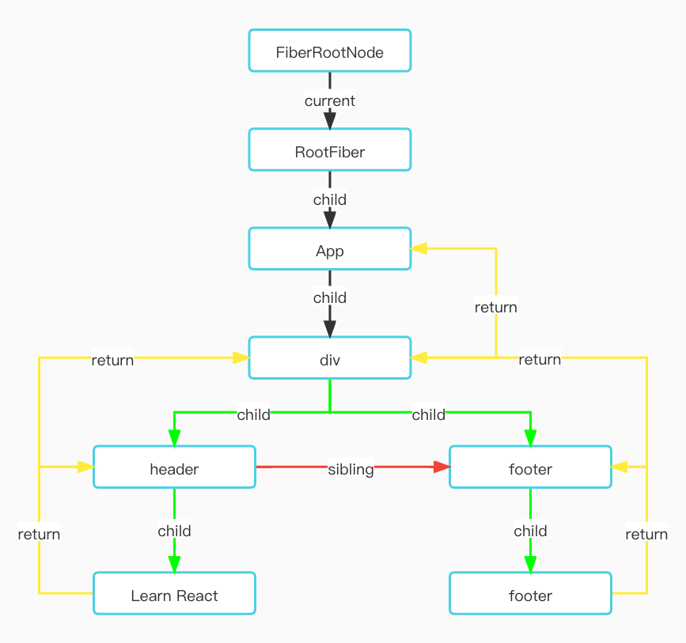
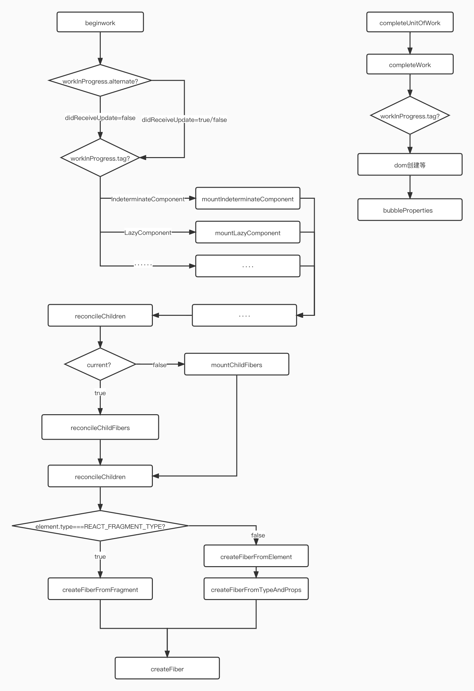

# 源码分析-Fiber 树的构建

### 一、Fiber 树概览图

```js
import React from 'react';
import ReactDOM from 'react-dom';

function App() {
    return (
        <div className="App">
            <header className="App-header">Learn React</header>
            <footer>footer</footer>
        </div>
    );
}

ReactDOM.render(<App />, document.getElementById('root'));
```

在 worKLoopSync 执行完，会生成一个如图下的 Fiber 树的结构数据


### 二、mount 阶段 Fiber 树构建流程

> 1. fiber 树的构建主要由 beginWork 和 completeUnitOfWork 两个函数执行构成。
> 2. beginWork 执行思路是深度遍历。从 FiberRoot 不断向下返回子 Fiber，子 Fiber 会赋值给 workingProgress,如果没有子 Fiber,则 workingProgress 赋值为 null 后，就进入了 completeUnitOfWork 逻辑
> 3. completeUnitOfWork 执行思路是深度优先执行 fiber 的 completeWork 工作。执行完 completeWork，当前 fiber 节点有 sibling 兄弟节点，则赋值给 workingProgress，兄弟节点继续执行 beginWork 流程，如果没有兄弟节点，则 fiber 的 return 父节点进入 completeWork 流程。
> 4. fiber 树的构建就是深度优先遍历的结果。



### 1. mount 阶段 beginWork 过程

> beginwork的工作就是创建子fiber节点
>
> current就是workInProgress的alternate属性。跟fiber双缓存机制有关，主要用于复用前节点，达到优化fiberNode创建过程。
>
> 首屏渲染current值是存在的，可以在createFiberRoot有体现。

```js
function beginWork(
  current: Fiber | null,
  workInProgress: Fiber,
  renderLanes: Lanes,
): Fiber | null {
  if (current !== null) {
    const oldProps = current.memoizedProps;
    const newProps = workInProgress.pendingProps;
    // 判断props、context是否有变化，走优化逻辑
    if (oldProps !== newProps || hasLegacyContextChanged()) {
      didReceiveUpdate = true;
    } else {
      // ========省略
    }
  } else {
    didReceiveUpdate = false;
  }
  workInProgress.lanes = NoLanes;
  switch (workInProgress.tag) {
    case IndeterminateComponent:
    case LazyComponent:
    // ========省略
    }
  }
}
```

#### 2. updateHostRoot

> updateHostRoot处理根Fiber节点的相关逻辑

```js
function updateHostRoot(current, workInProgress, renderLanes) {
  const updateQueue = workInProgress.updateQueue;
  const nextProps = workInProgress.pendingProps;
  const prevState = workInProgress.memoizedState;
  const prevChildren = prevState.element;
  // 从current复制updateQuee到workInProgress
  cloneUpdateQueue(current, workInProgress);
  // 
  processUpdateQueue(workInProgress, nextProps, null, renderLanes);
  const nextState = workInProgress.memoizedState;
  const root: FiberRoot = workInProgress.stateNode;

  const nextChildren = nextState.element;
  if (nextChildren === prevChildren) {
    return bailoutOnAlreadyFinishedWork(current, workInProgress, renderLanes);
  }
  // 省略了部分代码、、、、、
  reconcileChildren(current, workInProgress, nextChildren, renderLanes);
  resetHydrationState();
  return workInProgress.child;
}
```

#### 3. processUpdateQueue

