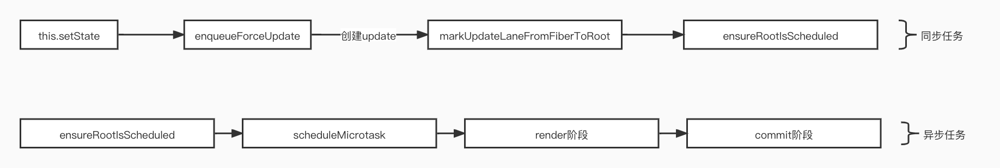

# 源码分析 setState过程

> 1. 解决setState 在同步执行为何可以合并？答案在（ensureRootIsScheduled）



## 几行代码掌握原理
```js
let obj = {
  a: 1,
  b: 2,
};

const setState = (isSync, data) => {
  if(isSync){
    setTimeout(() => {
      obj = { ...obj, ...data};
    }, 0);
  }else{
     obj = { ...obj, ...data};
  }
};

const test01 = () => {
  setState(true, { a: 3 });
  console.log(obj); // { a: 1, b: 2 }
  setState(true, { b: 2 });
  console.log(obj); // { a: 1, b: 2 }
};

const test02 = () => {
  setTimeout(() => {
    setState(false, { a: 6 });
    console.log(obj); // { a: 6, b: 2 }
    setState(false, { b: 7 });
    console.log(obj); // { a: 6, b: 7 }
  }, 1000);
};
test01();
test02();
````
## 1.this.setState内调用this.updater.enqueueSetState

```js
Component.prototype.setState = function (partialState, callback) {
  if (!(typeof partialState === 'object' || typeof partialState === 'function' || partialState == null)) {
    {
      throw Error( "setState(...): takes an object of state variables to update or a function which returns an object of state variables." );
    }
  }
  this.updater.enqueueSetState(this, partialState, callback, 'setState');
};
```

## 2. enqueueForceUpdate
```js
enqueueForceUpdate(inst, callback) {
    const fiber = getInstance(inst);
    const eventTime = requestEventTime();
    const suspenseConfig = requestCurrentSuspenseConfig();
    const lane = requestUpdateLane(fiber, suspenseConfig);
  
    const update = createUpdate(eventTime, lane, suspenseConfig);
      
    //tag赋值ForceUpdate
    update.tag = ForceUpdate;
      
    if (callback !== undefined && callback !== null) {
      update.callback = callback;
    }
      
    enqueueUpdate(fiber, update);
    scheduleUpdateOnFiber(fiber, lane, eventTime);
  },
};
```
## 3. ensureRootIsScheduled

> 在React.render的分析，有粗略一提这个函数，没有详细说明这个函数处理了什么
>
> 1. 判断FiberRoot的是否有存在的task任务，如果有则终止，没有则创建新的任务。
> 2. 判断当前的任务类似，是否是SyncLane，如果是则执行scheduleMicrotask，否则以一个优先级执行scheduleCallback的函数。
> 3. 在同步的setState过程scheduleMicrotask其实就是Promise.resolve(null) .then(callback),这也是为什么可以合并多个setState的原因。

```js
function ensureRootIsScheduled(root: FiberRoot, currentTime: number) {
  const existingCallbackNode = root.callbackNode;

  markStarvedLanesAsExpired(root, currentTime);

  const nextLanes = getNextLanes(
    root,
    root === workInProgressRoot ? workInProgressRootRenderLanes : NoLanes,
  );

  if (nextLanes === NoLanes) {
    if (existingCallbackNode !== null) {
      cancelCallback(existingCallbackNode);
    }
    root.callbackNode = null;
    root.callbackPriority = NoLane;
    return;
  }

  const newCallbackPriority = getHighestPriorityLane(nextLanes);

  const existingCallbackPriority = root.callbackPriority;
  // 如果已经存在一个任务在运行中，则直接退出
  if (existingCallbackPriority === newCallbackPriority) {
    // The priority hasn't changed. We can reuse the existing task. Exit.
    return;
  }


  if (existingCallbackNode != null) {
    // Cancel the existing callback. We'll schedule a new one below.
    cancelCallback(existingCallbackNode);
  }

  // Schedule a new callback.
  let newCallbackNode;
  if (newCallbackPriority === SyncLane) {
    // Special case: Sync React callbacks are scheduled on a special
    // internal queue
    if (root.tag === LegacyRoot) {
      scheduleLegacySyncCallback(performSyncWorkOnRoot.bind(null, root));
    } else {
      scheduleSyncCallback(performSyncWorkOnRoot.bind(null, root));
    }
    if (supportsMicrotasks) {
        scheduleMicrotask(flushSyncCallbacks);
    } else {
      scheduleCallback(ImmediateSchedulerPriority, flushSyncCallbacks);
    }
    newCallbackNode = null;
  } else {
    let schedulerPriorityLevel;
    switch (lanesToEventPriority(nextLanes)) {
      case DiscreteEventPriority:
        schedulerPriorityLevel = ImmediateSchedulerPriority;
        break;
      case ContinuousEventPriority:
        schedulerPriorityLevel = UserBlockingSchedulerPriority;
        break;
      case DefaultEventPriority:
        schedulerPriorityLevel = NormalSchedulerPriority;
        break;
      case IdleEventPriority:
        schedulerPriorityLevel = IdleSchedulerPriority;
        break;
      default:
        schedulerPriorityLevel = NormalSchedulerPriority;
        break;
    }
    newCallbackNode = scheduleCallback(
      schedulerPriorityLevel,
      performConcurrentWorkOnRoot.bind(null, root),
    );
  }
  root.callbackPriority = newCallbackPriority;
  root.callbackNode = newCallbackNode;
}
```

