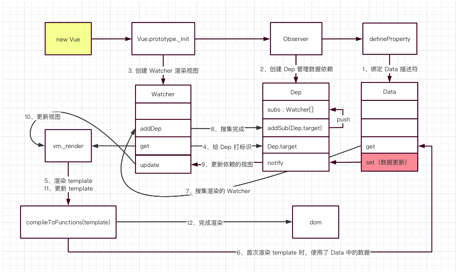

# Vue原理（vue2.x）



## 一、了解Object的属性defineProperty

```js
const Book = {}
let name = ''
Object.defineProperty(Book, 'name', {
    set: (value) => {
        name = value
    },
    get: () => {
        return `《${name}》`
    }
})
Book.name = 'vue实现原理'
console.log(Book.name) // 《vue实现原理》
```

## 二、实现一个Observer监听data的所有属性，如果改变，就通知订阅者
```js
class Observer {
    constructor (data) {
        this.data = data
        this.init(data)
    }
    init (data) {
        Object.keys(data).forEach((key) => {
            this.defineReactive(data, key, data[key]);
        });
    }
    observerChildProperty (data) {
        if (!data || typeof data !== 'object') {
            return;
        } else {
            this.init(data)
        }
    }
    defineReactive (data, key, val) {
        const dep = new Dep();
        Object.defineProperty(data, key, {
            enumerable: true,
            configurable: true,
            get: () => {
                // 当初次获取属性值的时候，添加watcher进来
                if (Dep.target) {
                    dep.addSub(Dep.target);
                }
                return val;
            },
            // 当data数据发生改变，执行订阅器存储的函数(watcher.update方法)
            set: (newVal) =>  {
                if (newVal === val) {
                    return;
                }
                val = newVal;
                dep.notify();
            }
        });
        /*监听对象的子属性*/
        this.observerChildProperty(val);
    }
}
```

### 三、订阅器
```js
class Dep {
    constructor () {
        this.subs = []
    }
    addSub (sub) {
        this.subs.push(sub);
    }
    notify () {
        this.subs.forEach((sub) => {
            sub.update();
        });
    }
}
Dep.target = null;
```
### 四、订阅者
```js
class Watcher {
    /**
     * @param vm vue实例
     * @param exp 监听的值
     * @param cb 当值改变时的回调函数
     */
    constructor (vm, exp, cb) {
        this.cb = cb;
        this.vm = vm;
        this.exp = exp;
        // 初始添加到订阅器
        this.value = this.get();
    }
    update () {
        const value = this.vm.data[this.exp];
        const oldVal = this.value;
        if (value !== oldVal) {
            this.value = value;
            this.cb.call(this.vm, value, oldVal);
        }
    }
    get () {
        Dep.target = this;
        // 强制执行监听器里的get函数
        const value = this.vm.data[this.exp]
        Dep.target = null;
        return value;
    }
}
```
### 五、解析器 Compile
```js
class Compile {
    constructor (el, vm) {
        this.vm = vm;
        this.el = document.querySelector(el);
        this.fragment = null;
        this.init();
    }

    /**
     * 初始化dom树，解析dom结构
     */
    init () {
        if (this.el) {
            this.fragment = this.nodeToFragment(this.el);
            this.compileElement(this.fragment);
            this.el.appendChild(this.fragment);
        }
    }

    /**
     * 将node添加到一个dom容器
     * @param el
     * @returns {DocumentFragment}
     */
    nodeToFragment (el) {
        const fragment = document.createDocumentFragment();
        let child = el.firstChild;
        while (child) {
            fragment.appendChild(child);
            child = el.firstChild
        }
        return fragment;
    }

    /**
     * 解析dom树结构
     * @param el
     */
    compileElement(el) {
        const childNodes = el.childNodes;
        [].slice.call(childNodes).forEach((node) => {
            const reg = /\{\{(.*)\}\}/;
            const text = node.textContent;
            if (this.isElementNode(node)) {
                this.compile(node);
            } else if (this.isTextNode(node) && reg.test(text)) {
                this.compileText(node, reg.exec(text)[1]);
            }
            if (node.childNodes && node.childNodes.length) {
                this.compileElement(node);
            }
        });
    }

    /**
     * 分发指令
     * @param node
     */
    compile (node) {
        const nodeAttrs = node.attributes;
        Array.prototype.forEach.call(nodeAttrs, (attr) => {
            const attrName = attr.name;
            if (this.isDirective(attrName)) {
                const exp = attr.value;
                const dir = attrName.substring(2);
                if (this.isEventDirective(dir)) {  // 事件指令
                    this.compileEvent(node, this.vm, exp, dir);
                } else {  // v-model 指令
                    this.compileModel(node, this.vm, exp, dir);
                }
                node.removeAttribute(attrName);
            }
        });
    }

    /**
     * 解析textNode
     * @param node
     * @param exp
     */
    compileText (node, exp) {
        const initText = this.vm[exp];
        this.updateText(node, initText);
        new Watcher(this.vm, exp,  (value) => {
            this.updateText(node, value);
        });
    }

    /**
     * 解析事件
     * @param node
     * @param vm
     * @param exp
     * @param dir
     */
    compileEvent (node, vm, exp, dir) {
        const eventType = dir.split(':')[1];
        const cb = vm.methods && vm.methods[exp];
        if (eventType && cb) {
            node.addEventListener(eventType, cb.bind(vm), false);
        }
    }

    /**
     * 解析v-model
     * @param node
     * @param vm
     * @param exp
     * @param dir
     */
    compileModel (node, vm, exp, dir) {
        let val = this.vm[exp];
        this.modelUpdater(node, val);
        new Watcher(this.vm, exp,  (value) => {
            this.modelUpdater(node, value);
        });

        node.addEventListener('input', (e) => {
            const newValue = e.target.value;
            if (val === newValue) {
                return;
            }
            this.vm[exp] = newValue;
            val = newValue;
        });
    }

    /**
     * 更新textNode的值
     * @param node
     * @param value
     */
    updateText (node, value) {
        node.textContent = typeof value == 'undefined' ? '' : value;
    }

    /**
     * 更新v-model的值
     * @param node
     * @param value
     * @param oldValue
     */
    modelUpdater (node, value, oldValue) {
        node.value = typeof value == 'undefined' ? '' : value;
    }
    isDirective (attr) {
        return attr.indexOf('v-') == 0;
    }
    isEventDirective (dir) {
        return dir.indexOf('on:') === 0;
    }
    isElementNode (node) {
        return node.nodeType == 1;
    }
    isTextNode (node) {
        return node.nodeType == 3;
    }
}
```
### 六、Vue实例
```js
class Vue {
    constructor (options) {
        this.data = options.data;
        this.methods = options.methods;
        Object.keys(this.data).forEach((key) => {
            this.proxyKeys(key);
        });
        new Observer(this.data);
        new Compile(options.el, this);
        options.mounted.call(this);
    }
    // 代理属性 this.data[xx]可以直接通过this[xx]修改属性值
    proxyKeys (key) {
        Object.defineProperty(this, key, {
            enumerable: false,
            configurable: true,
            get: () => {
                return this.data[key];
            },
            set: (newVal) => {
                this.data[key] = newVal;
            }
        });
    }
}
<!DOCTYPE html>
<html lang="en">
<head>
    <meta charset="UTF-8">
    <title>vue</title>
</head>
<style>
    #app {
        text-align: center;
    }
</style>
<body>
<div id="app">
    <h2>{{title}}</h2>
    <input v-model="name">
    <h1>{{name}}</h1>
    <div>
        <button v-on:click="clickMe">click me!</button>
    </div>
</div>
</body>
<script src="js/dep.js"></script>
<script src="js/observer.js"></script>
<script src="js/watcher.js"></script>
<script src="js/compile.js"></script>
<script src="js/index.js"></script>
<script type="text/javascript">
    new Vue({
        el: '#app',
        data: {
            title: 'hello world',
            name: 'abc'
        },
        methods: {
            clickMe: function () {
                this.title = 'hello world2';
            }
        },
        mounted: function () {
            window.setTimeout(() => {
                this.title = '你好';
            }, 1000);
        }
    });
</script>
</html>
```